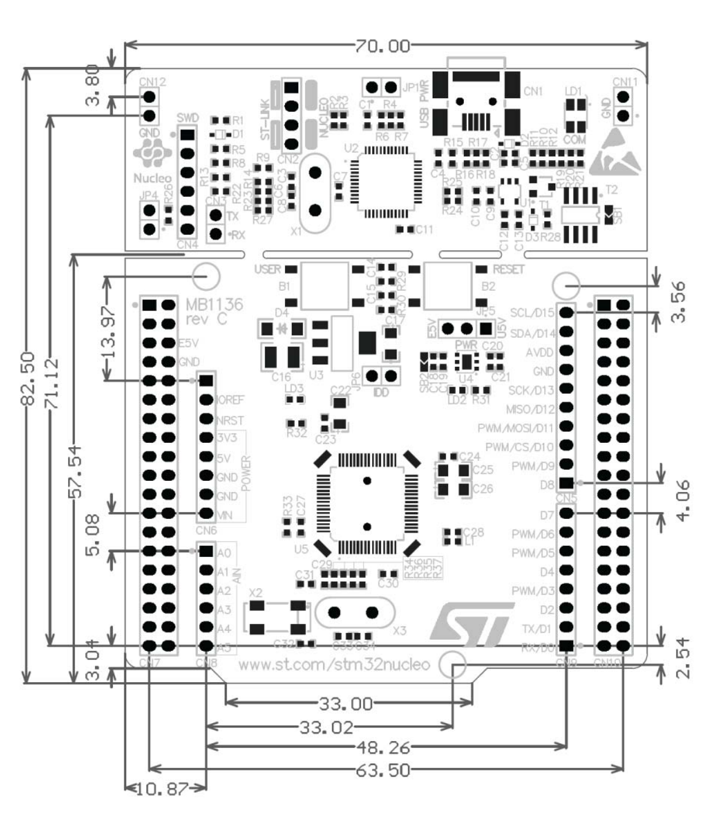

> # Extract of User Manual_Nucleo-64 F401RE
>
> ##### Group 3

# Hardware Layout

## 分区

## 正面

## 背面

## 尺寸

## LED

### LD1(COM)

The tricolor LED (green, orange, red) LD1 (COM) provides information about ST-LINK  communication status. LD1 default color is red. LD1 turns to green to indicate that  communication is in progress between the PC and the ST-LINK/V2-1, with the following  setup: 

- Slow blinking Red/Off: at power-on before USB initialization
- Fast blinking Red/Off: after the first correct communication between the PC and  ST-LINK/V2-1 (enumeration) 
- Red LED On: when the initialization between the PC and ST-LINK/V2-1 is complete
- Green LED On: after a successful target communication initialization
- Blinking Red/Green: during communication with the target 
- Green On: communication finished and successful
- Orange On: Communication failure 

### LD2(User)

The green LED is a user LED connected to ARDUINO® signal D13 corresponding  to STM32 I/O PA5 (pin 21) or PB13 (pin 34) depending on the STM32 target. 

Refer to  Table 11 to Table 23 when: 

- the I/O is HIGH value, the LED is on
- the I/O is LOW, the LED is off 

### LD3(PWR)

The red LED indicates that the STM32 part is powered and +5V power is  available

## OSC时钟配置

### HSE

- #### MCO from ST-LINK(Defalut On MB1136 C-02 or higher)

    - Fixed at **8MHz**
    - **Configuration**
        - SB55 OFF & SB54 ON
        - SB16 amd SB50 ON
        - R35 and R37 Removed

- HSE oscillator on-board from X3 crystal (not provided)

- Oscillator from external PF0/PD0/PH0

- HSE not used(Defalut On MB1136 C-01)

### LSE

- #### On-board oscillator(Defalut On MB1136 C-02 or higher)

    - 32kHZ

        > *The board marking MB1136 C-02 (or higher) corresponds to a board configured with  on-board 32 kHz oscillator. The board marking MB1136 C-03 (or higher) corresponds to a board using new LSE crystal  (ABS25) and C26, C31, and C32 value update.*

- Oscillator from external PC14
- LSE not used(Defalut On MB1136 C-01)

## 引脚定义表

### ARDUINO part

> 1. Refer to *Solder bridges* for details

### ST part

https://zhuanlan.zhihu.com/p/646723640

# System Architecture

# Memory Map

