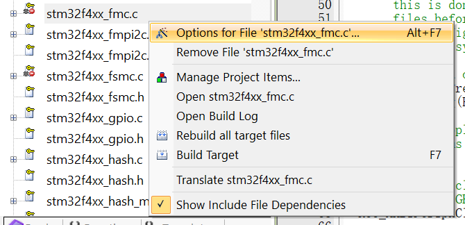

# STM32F401RE开发环境

#### 预备资源

- [F4官方标准固件库](https://link.csdn.net/?target=https%3A%2F%2Fmy.st.com%2Fcontent%2Fmy_st_com%2Fen%2Fproducts%2Fembedded-software%2Fmcu-mpu-embedded-software%2Fstm32-embedded-software%2Fstm32-standard-peripheral-libraries.html)
- [用于F4系列的Keil-MDK5芯片的 `.pack` 安装包](https://link.csdn.net/?target=https%3A%2F%2Fwww.keil.com%2Fdd2%2FPack%2F%23%2Feula-container)
- [ST-LINK utility 驱动下载](https://link.csdn.net/?target=https%3A%2F%2Fwww.st.com%2Fcontent%2Fst_com%2Fen%2Fproducts%2Fdevelopment-tools%2Fsoftware-development-tools%2Fstm32-software-development-tools%2Fstm32-programmers%2Fstsw-link004.html)

## Keil上使用标准库的 STM32 开发流程

- #### 新建工程

    - 输入F401RE

    - 选上CMSIS-CORE和DEVICE-Startup两个选项

        

- #### 添加系列文件

    - ##### 新建文件夹

        - 
        - 将 `\STM32F4xx_DSP_StdPeriph_Lib_V1.9.0\Libraries\CMSIS\Device\ST\STM32F4xx\Include`中的 **stm32f4xx.h** 和 **system_stm32f4xx.h** 复制到 `Startup` 中
        - 将`\STM32F4xx_DSP_StdPeriph_Lib_V1.9.0\Libraries\STM32F4xx_StdPeriph_Driver` 中 `inc` 和 `src` 文件夹中的所有文件都复制到 `Library` 中
        - 将 `STM32F4xx_DSP_StdPeriph_Lib_V1.9.0\Project\STM32F4xx_StdPeriph_Templates` 中的 **stm32f4xx_conf.h**、**stm32f4xx_it.c** 和 **stm32f4xx_it.h** 复制到 User 中

    -  ##### 在Keil5中配置相关设置

        - Add Group

            - 在keil5工程中添加以上三个同名文件夹，并Add Existing Files。
            - 在User中新建main.c和main.h（直接复制粘贴官方样例工程中的也行）

            

        - 配置include路径

            - 点击魔术棒-c/c++-include path

            - 添加：

                

        - 配置宏定义

            - 点击魔术棒-c/c++-include path

            - 添加：

                

        - 配置编译器

            - 点击魔术棒-Target

            - 选择 “Use default compiler version 5”

                

        - 将 **stm32f4xx_fmc.c** 和  **stm32f4xx_fsmc.c** 移除编译列表

            > 很奇怪。这两个文件里有一大堆宏定义报错——显示Undefined。在官方给出的样例工程文件中，也将这两个文件移除了编译列表。

              

- #### 配置下载器

    - 选择ST-Link Debugger

## 消除250个WARNNING

修改这里11581~11585如下

## CLion / VS code 开发环境

> “前方的区域以后再来探索吧!''