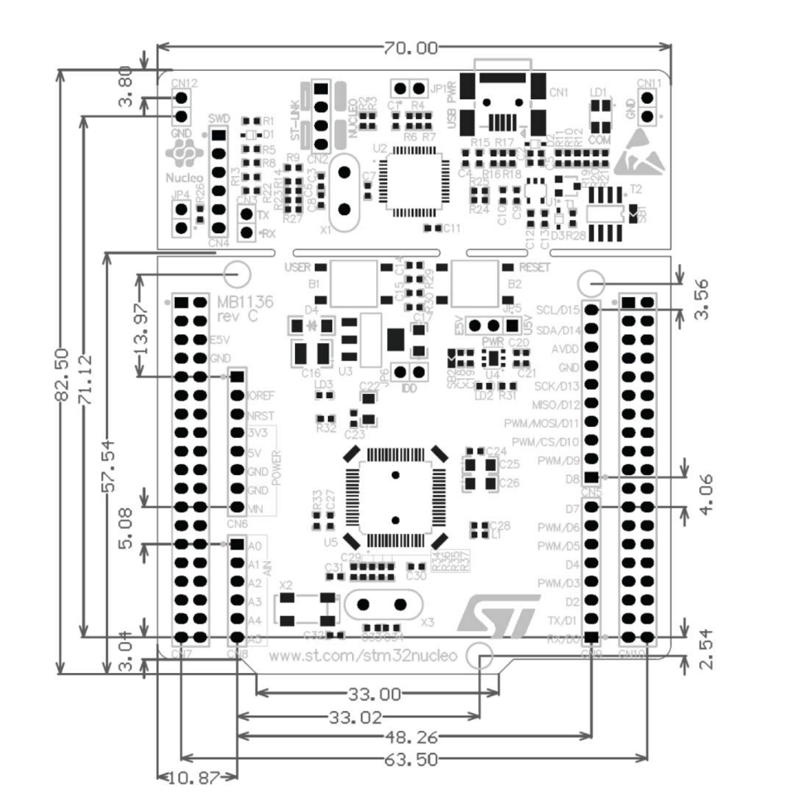

## 需要的封装

| 封装                     | 数量 | 用途     | 接线                               |
| ------------------------ | ---- | -------- | ---------------------------------- |
| 19*2 排母                | 2    | F401     | F401                               |
| 1*3 弯排针               | 4    | 电机     | pwm(PA6-PA7-PB0-PB1)-悬空-GND      |
| 1*3 排母（有没有弯的？） | 1    | 接收机   | ppm(PA1)-5v-GND                    |
| xt30pw-m                 | 1    | 供电     | GND-5V                             |
| 1*3 孔                   | 1    | 电源开关 | 5v-GND-GND                         |
| 1*4 排母（需要弯的）     | 1    | OLED     | GND-VCC-SCL(PC0)-SDA(PC1)（待定）  |
| 1*6 排母                 | 1    | 蓝牙     | VCC-GND-TX(PA9)-RX(PA10)-悬空-悬空 |
| M?螺丝孔                 | 2    | 固定     | - -                                |