> # 挑战一：汇编点灯
>
> ##### Group 3
>

#### 參考资料

- ##### [在Keil5上创建纯汇编语言的STM32工程](https://blog.csdn.net/qq_53072511/article/details/120456666#:~:text=1、新建工程%20双击打开%20Keil5%20，然后点击菜单栏的%20projrct选择NEW%20uVision%20Project%20如下图所示：,Item%20to%20Group添加源文件，%20然后选择%20Asm%20File%20%28.s%29%20创建汇编文件，自己定一个喜欢的源文件名称点击保存即可%E3%80%82)

- ##### [STM32汇编程序及点灯实验](https://blog.csdn.net/lxy13608322474/article/details/111773624)

- ##### [ARM汇编指令](https://zhuanlan.zhihu.com/p/164415889)

- ##### [ARM汇编系列--入门篇](https://blog.csdn.net/mmphhh/article/details/100135265)

- ##### [[深入剖析STM32]STM32 启动流程详解](https://zhuanlan.zhihu.com/p/430014447)

- ##### [GPIO中ODR、BRR、BSRR详解](https://blog.csdn.net/byhunpo/article/details/88996657)

#### 开发环境

- Windows 11
- MDK 5.34.0.0
- STM32F03C8T6 主控板

# 新建工程

## 文件架构

- ##### 勾選 Manage Run-Time Environment 中

  - ##### CMSIS-CORE

  - Device-Startup

    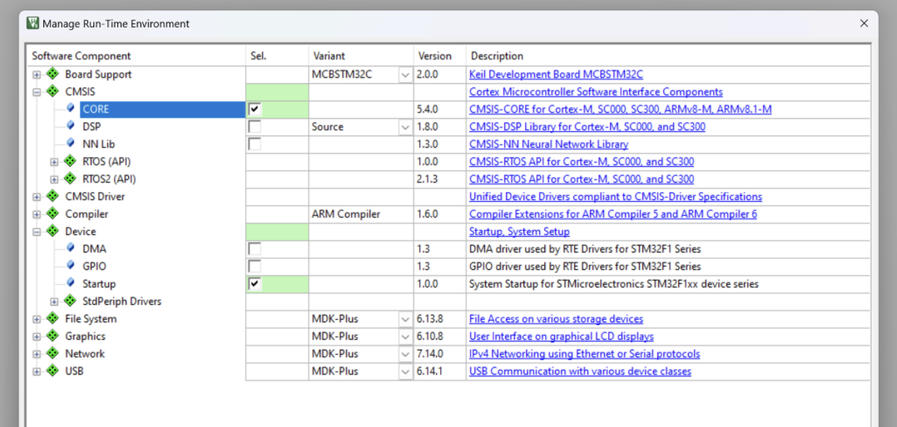

- ##### 在  `Source Group1` 文件夹中新建 `main.c` 和 `xxxxx.s`

  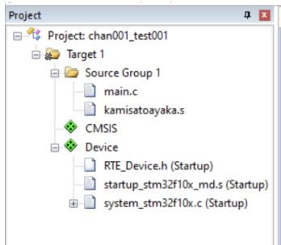


# 点亮LED

## 整体架构

- 使用 **ARM汇编语言** 编写相关函数于 `KamisatoAyaka.s` 文件中，在 `main.c` 中调用这些由汇编语言编写的函数实现小灯闪烁的功能。

- 调用最小系统版上自带的LED小灯。经查阅原理图，该小灯位由 GPI/O_C_Pin13控制。

  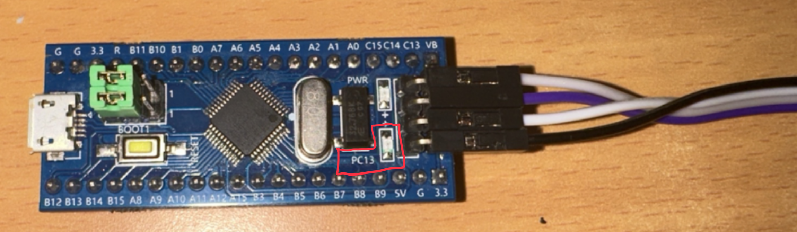

## `main.c`

- 直接 `extern` 声明函数，就可以调用 `KamisatoAyaka.s` 中使用汇编语言编写的函数了。

``` c
extern void RCC_init(void);
extern void LED_init(void);
extern void LED_ON(void);
extern void LED_OFF(void);
extern void Delay(int time);
```

## `xxxxxxx.s`

- 名字任意取，是一个存放用汇编函数的文件。                                                                                                                                                                                                                                                                                    

### 初始化时钟

目标是用汇编语言编写函数 `RCC_Init` 来为GPIO_C打开时钟源头。涉及到以下步骤：

- #### 查阅 Memory Map

  - 在 *Memory and Bus Architecture* 一节中找到 **Reset and clock control RCC** 外设的地址

    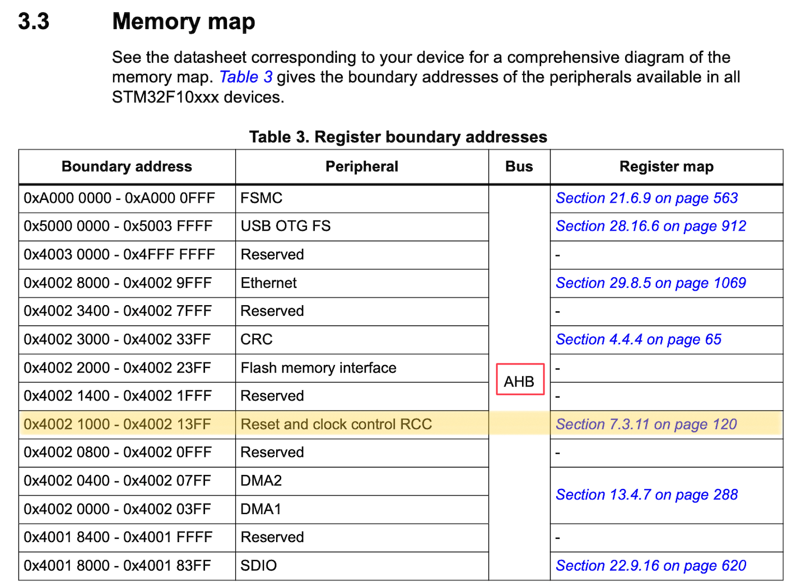

    - 由图可知，其起始地址为 `0x4002 1000`，挂载于 **AHB总线** 

- #### 查阅 System Architecture

  - 本次使用F103系列芯片，属于在 *Memory and Bus Architecture* 一节中找到下图

    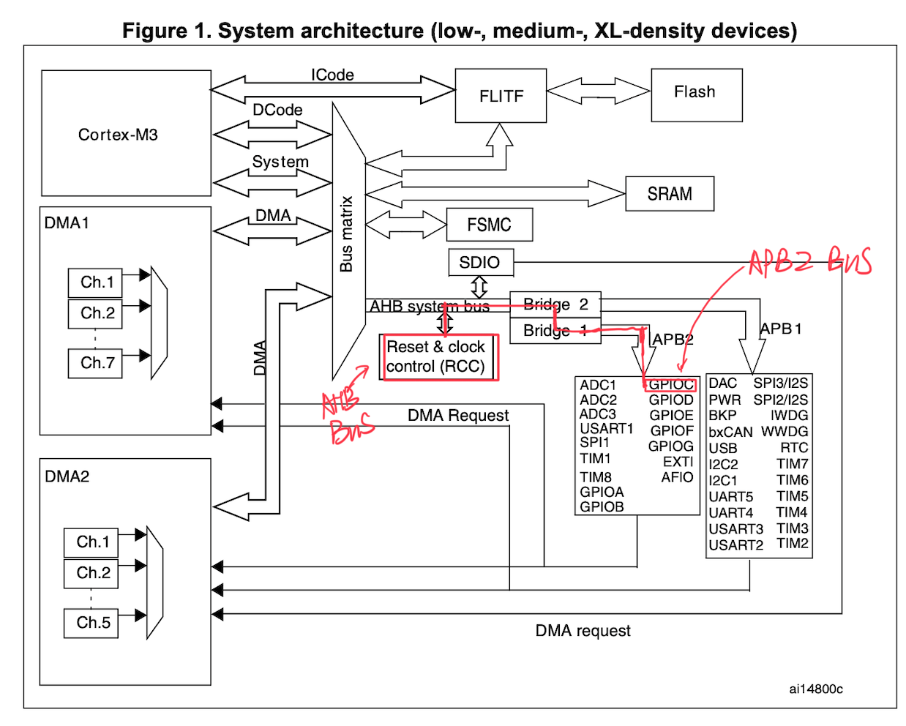

    - 不难发现，RCC挂载在AHB总线上，经Bridge1桥接至APB2总线。

    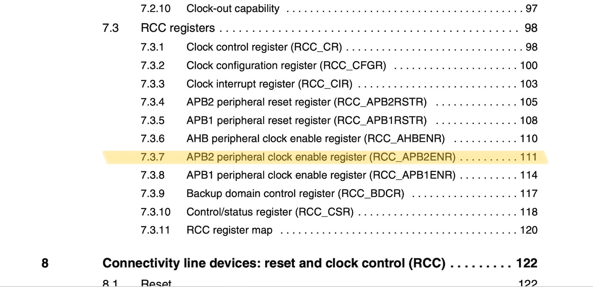

  - 点开 **APB2 peripheral clock enable register (RCC_APB2ENR) **

    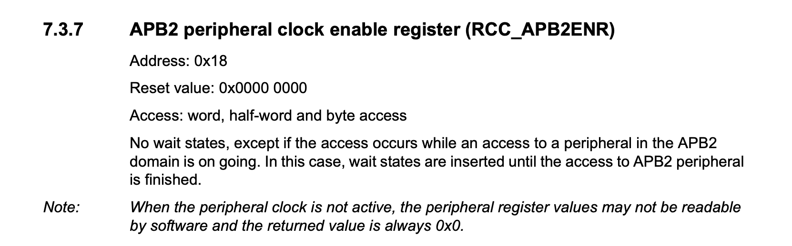

    - **偏移地址**：`0x18`，根据上方查到的起始地址，可以确定 `RCC_APB2ENR` 的值为 `0x4002 1018`

    ``` assembly
    RCC_APB2ENR EQU 0x40021018
    ```

- #### 查阅APB2ENR寄存器配置

  - 

  - 到这一步，我们就确定下来RCC控制APB2上外设较精确的地址范围了，下一步是为GPI/O_C开启时钟：

    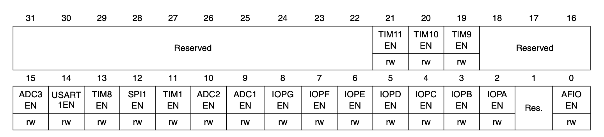

    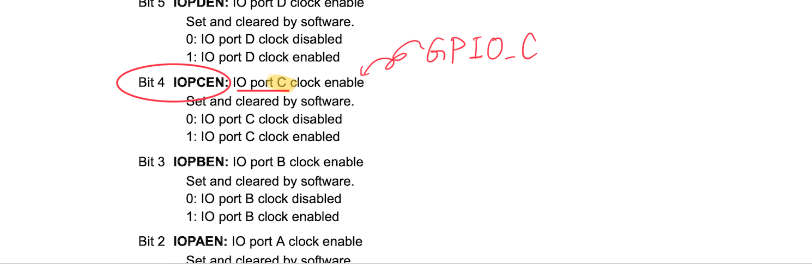

    - 根据说明，我们将 **APB2 peripheral clock enable register** 寄存器的值应该为

      `0000 0000 0000 0000 0000 0000 0001 0000`，即 `0x00000010`

- 到这一步，编写初始化时钟的函数步骤就清晰了。下面是汇编代码：

  ``` assembly
  RCC_init
  				; 从内存加载RCC_APB2ENR地址到寄存器R0
          LDR R0, =RCC_APB2ENR
  
          ; 将RCC_APB2ENR的值与0x10进行按位或运算
          ORR R0, R0, #0x10
  
          ; 从内存加载RCC_APB2ENR地址到寄存器R1
          LDR R1, =RCC_APB2ENR
  
          ; 将R0的值写入RCC_APB2ENR寄存器，启用特定的外设/时钟
          STR R0, [R1]
  ```
  
  > 才发现Markdown里汇编语言的代码块应该用`Assembly`

### 初始化GPIO

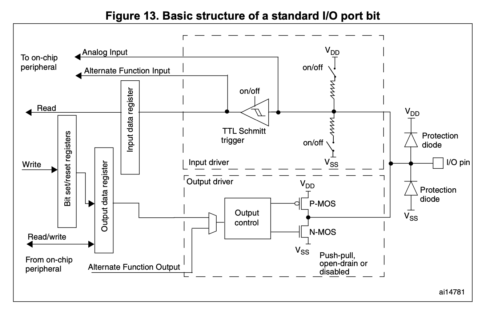

目标是用汇编语言编写函数 `LED_init` 完成GPIO口初始化的工作。涉及到以下步骤：

#### 配置GPIO_C_Pin13 为通用输出

- #### 查阅 Memory Map

  - 在 *Memory and Bus Architecture* 一节中找到 **GPIO Port C** 外设的地址

  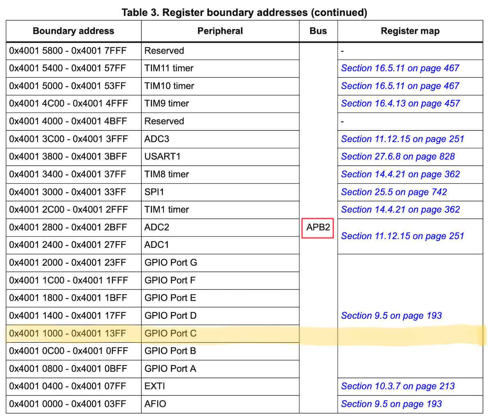

  - GPIO Port C 的起始地址 `0x4001 1000`

- #### 查找目录，找到配置GPIO口的寄存器

  - ##### 目录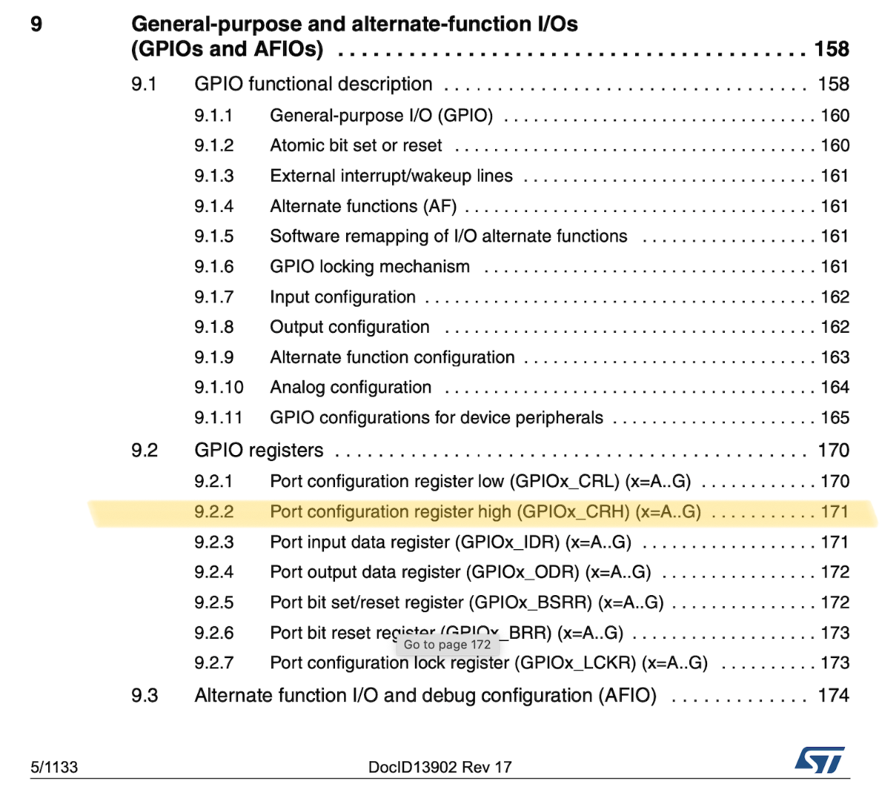

    - GPIO配置寄存器由两个：**GPIOx_CRL**、**GPIOx_CRH**
      - CRL配置Pin0～Pin7
      - CRH配置Pin8～Pin15

  - ##### 寄存器详细配置说明：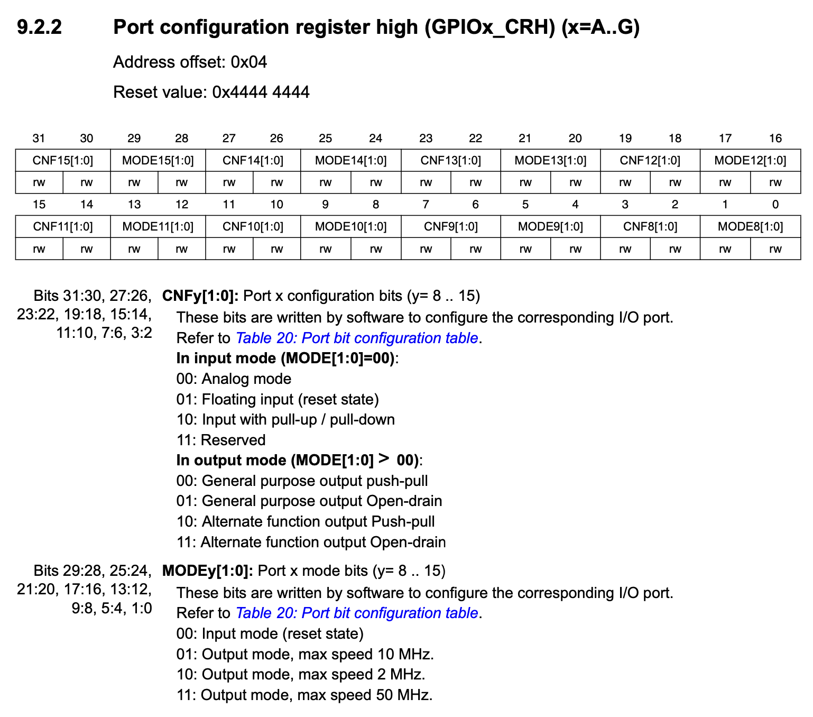

    - 偏移地址：`0x04`，根据前面查出来起始地址 `0x4001 1000`，那**GPIOx_CRH**的地址就是 `0x4001 1004`

    ``` assembly
    GPIOx_CRH EQU 0x40011004
    ```

    - 我们要配置的是 `Pin_13` , 对应寄存器23:20 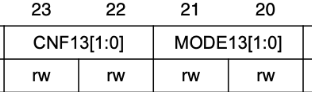

      - 选择**General purpose output push-pull**(推挽输出）、**MAX speed 50MHz**

      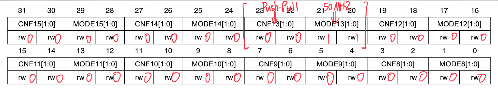

      由此可知，**GPIOx_CRH**应该配置为 `0000 0000 0011 0000 0000 0000 0000 0000`，即 `0x0030 0000`

#### 配置GPIO_C_Pin13 的初始电平状态

- 往下翻翻，到 **Port output data register(GPIOx_ODR)** 寄存器

  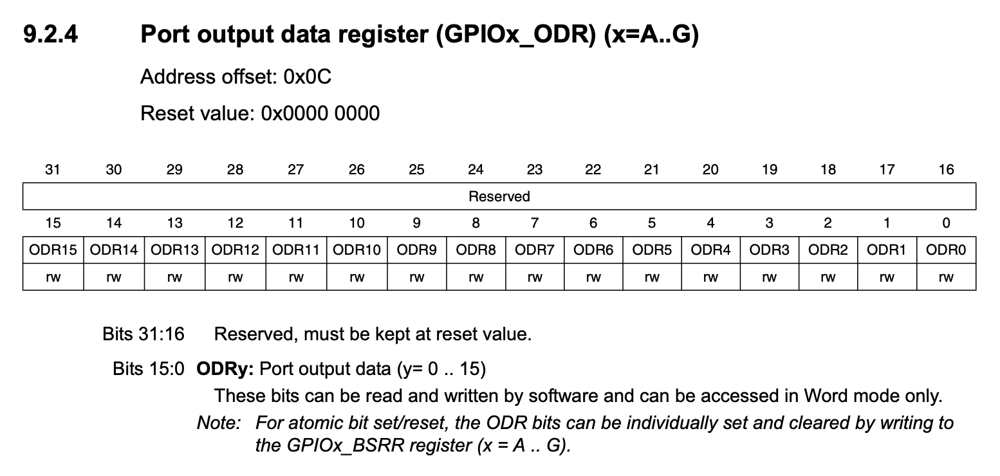

  - 偏移地址：`0x0C`，根据前面查出来起始地址 `0x4001 1000`，那**GPIOx_ODR**的地址就是 `0x4001 100C`

    ``` assembly
    ;EQU指令，类似于C语言中的 define
    GPIOx_ODR EQU 0x4001100C
    ```

    > ❓：中文手册：
    >
    > ​		 英文手册：
    >
    >  0Ch和0x0C在汇编语言中认哪个?

  - 对位13置 `1` ，便默认输出高电平。ODR寄存器的值便为 `0010 0000 0000 0000`，即 `0x2000`

- 到这一步，就可以接着写上面的代码了

``` assembly
LED_init
; 配置GPIOC为通用输出

        ; 从内存加载GPIOx_CRH的地址到寄存器R0
        LDR R0, =GPIOx_CRH

        ; 使用按位清零操作，将R0寄存器清零
        BIC R0, R0, #0xffffffff   ; 将R0清零

        ; 使用按位或操作，设置特定位以配置GPIOC的输出模式
        ORR R0, R0, #00300000

        ; 从内存加载GPIOx_CRH的地址到寄存器R1
        LDR R1, =GPIOx_CRH

        ; 将R0的值写入GPIOx_CRH寄存器，配置GPIOC为通用输出
        STR R0, [R1]

; 配置Pin_13的初始电平

        ; 从内存加载GPIOx_ODR的地址到寄存器R1
        LDR R1, =GPIOx_ODR

        ; 从内存加载GPIOx_ODR的值到寄存器R0
        LDR R0, [R1]

        ; 使用位操作，将Pin_13的位反转，其他位保持不变
        MOV R1, #~(1<<13)
        AND R0, R0, R1

        ; 从内存加载GPIOx_ODR的地址到寄存器R1
        LDR R1, =GPIOx_ODR

        ; 将R0的值写入GPIOx_ODR寄存器，设置Pin_13的初始电平
        STR R0, [R1]
						
```

### `LED_ON` & `LED_OFF` 函数

- 就是对**GPIOx_ODR**寄存器的配置，与上一段内容并无差别。
- 根据最小系统班原理图，该LED为PC13低电平点亮。

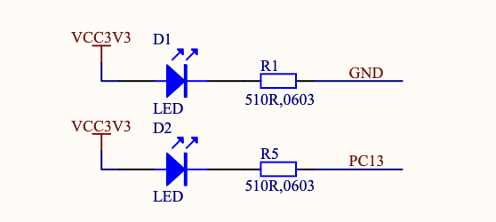

#### 方案一

- #### `void LED_OFF()`

  ``` assembly
  LED_ON
  				; 保存寄存器R0、R1和LR的值到栈中
  				PUSH {R0, R1, LR}
  
          ; 从内存加载GPIOx_ODR的地址到寄存器R1
          LDR R1, =GPIOx_ODR
  
          ; 使用按位清零操作，将R0寄存器清零
          BIC R0, R0, #0xffffffff   ; 将R0清零
  
          ; 使用按位或操作，设置特定位以设置GPIOx_ODR的某些位
          ORR R0, R0, #0x2000
  
          ; 从内存加载GPIOx_ODR的地址到寄存器R1
          LDR R1, =GPIOx_ODR
  
          ; 将R0的值写入GPIOx_ODR寄存器，设置GPIOx_ODR的某些位
          STR R0, [R1]
  
  				; 从栈中恢复寄存器R0、R1和PC的值，返回子程序
  				POP {R0, R1, PC}
  ```

- #### `void LED_ON()`

  ``` assembly
  LED_OFF
  				; 保存寄存器R0、R1和LR的值到栈中
  				PUSH {R0, R1, LR}
  
          ; 从内存加载GPIOx_ODR的地址到寄存器R1
          LDR R1, =GPIOx_ODR
  
          ; 使用按位清零操作，将R0寄存器清零
          BIC R0, R0, #0xffffffff   ; 将R0清零
  
          ; 将R0的值写入GPIOx_ODR寄存器，将GPIOx_ODR寄存器清零
          STR R0, [R1]
  
  				; 从栈中恢复寄存器R0、R1和PC的值，返回子程序
  				POP {R0, R1, PC}
  ```

- #### 缺陷

  - 虽然思路简单，但是使用 `BIC` 或者 `AND` 来对 `ODR` 寄存器直接操作，会改变ODR寄存器中与PIn13无关的位。如果GPIO其他接口上有输出的话，这这方法就会干扰到其他针脚的输出

#### 方案二

- #### `void LED_TOGGLE()`

  - 采取 **EOR 异或** 的方式来改变ODR寄存器的值：

  ``` assembly
  LED_TOGGLE
  
          ; 保存寄存器R0、R1和LR的值到栈中
          PUSH {R0, R1, LR}
  
          ; 从内存加载GPIOx_ODR的地址到寄存器R1
          LDR R1, =GPIOx_ODR
  
          ; 从内存加载GPIOx_ODR的值到寄存器R0
          LDR R0, [R1]
  
          ; 使用位操作，将Pin_13的位反转（切换LED状态）
          MOV R1, #(1 << 13)
          EOR R0, R0, R1
  
          ; 将R0的值写入GPIOx_ODR寄存器，切换LED状态
          STR R0, [R1]
  
          ; 从栈中恢复寄存器R0、R1和PC的值，返回子程序
          POP {R0, R1, PC}
  ```
  
  - 这样一来，不仅不会影响到其他针脚，还能将两个函数合并为一个函数，十分简洁。

### 让小灯闪烁

#### `Delay`函数

- 采取了一种简单的方式，让CPU做一些无关紧要的记数工作，时间间隔不是很精准：

  ``` assembly
  Delay
  
          ; 保存寄存器R0、R1和LR的值到栈中
          PUSH {R0, R1, LR}
  
          ; 将R0和R1寄存器清零，用于计数
          MOVS R0, #0
          MOVS R1, #0
  
  DelayLoop0
  
          ; 增加R0的值
          ADDS R0, R0, #1
  
          ; 比较R0和330的值
          CMP R0, #330
          ; 如果R0小于330，继续延时循环
          BCC DelayLoop0
  
          ; 将R0清零，准备下一次延时
          MOVS R0, #0
          ; 增加R1的值
          ADDS R1, R1, #1
          ; 比较R1和330的值
          CMP R1, #330
          ; 如果R1小于330，继续延时循环
          BCC DelayLoop0
  
          ; 从栈中恢复寄存器R0、R1和PC的值，返回子程序
          POP {R0, R1, PC}
          ; 空指令，可选的占位符（没有实际操作）
          NOP
  ```

- 这即是这份汇编代码的最后一个函数，记得在文件末尾加上 `END`


# 工程代码

## `main.c`

``` c
extern void LED_init(void);
extern void LED_TOGGLE(void);
extern void RCC_init(void);
extern void Delay(void);

int main(void)
{
	RCC_init();
	LED_init();
	while(1)
	{
		LED_TOGGLE();
		Delay();
	}	
}
```

## `kamisatoayaka.s`

``` assembly
RCC_APB2ENR EQU 0x40021018
GPIOx_ODR   EQU 0x4001100C
GPIOx_CRH   EQU 0x40011004

						AREA	  EXAMPLE,CODE,READONLY
						EXPORT    LED_init
						EXPORT    LED_TOGGLE
						EXPORT    RCC_init
						EXPORT    Delay
		
							
						ENTRY        
RCC_init
						PUSH {R0,R1,LR}
						
						LDR R0,=RCC_APB2ENR
						ORR R0,R0,#0x10
						LDR R1,=RCC_APB2ENR
						STR R0,[R1]		
						
						POP {R0,R1,PC}
				
				
LED_init
						PUSH {R0,R1,LR}
						;配置GPIOC为通用输出

						LDR R0,=GPIOx_CRH
						BIC R0,R0,#0xffffffff   ;将R0清零
						ORR R0,#0x00300000
						LDR R1,=GPIOx_CRH
						STR R0,[R1]
						;配置Pin_13的初始电平
						LDR R1,=GPIOx_ODR
						BIC R0,R0,#0xffffffff   ;将R0清零
						ORR R0,R0,#0x2000
						LDR R1,=GPIOx_ODR
						STR R0,[R1]
    
						POP {R0,R1,PC}

LED_TOGGLE
						PUSH {R0,R1,LR}
						
						LDR R1,=GPIOx_ODR
						LDR R0,[R1]
						MOV R1,#(1<<13)
						EOR R0,R0,R1
						LDR R1,=GPIOx_ODR
						STR R0,[R1]
						
						POP {R0,R1,PC}
						

Delay
						PUSH {R0,R1, LR}
                
						MOVS R0,#0
						MOVS R1,#0

                
DelayLoop0        
						ADDS R0,R0,#1
 
						CMP R0,#330
						BCC DelayLoop0
                
						MOVS R0,#0
						ADDS R1,R1,#1
						CMP R1,#330
						BCC DelayLoop0 
 
                
						POP {R0,R1,PC}    
						NOP
						
						
						END
```


> # 随想录
>
> ##### 挑战一


# 时钟&启动 —— RCC

> #### 参考资料
>
> [STM32时钟树（结合系统时钟函数理解）](https://blog.csdn.net/qq_43743762/article/details/96908457)

- #### 时钟是什么？

  - 有了时钟就能计时，有了时间就能通过一些操作产生周期性的时间脉冲信号了。

  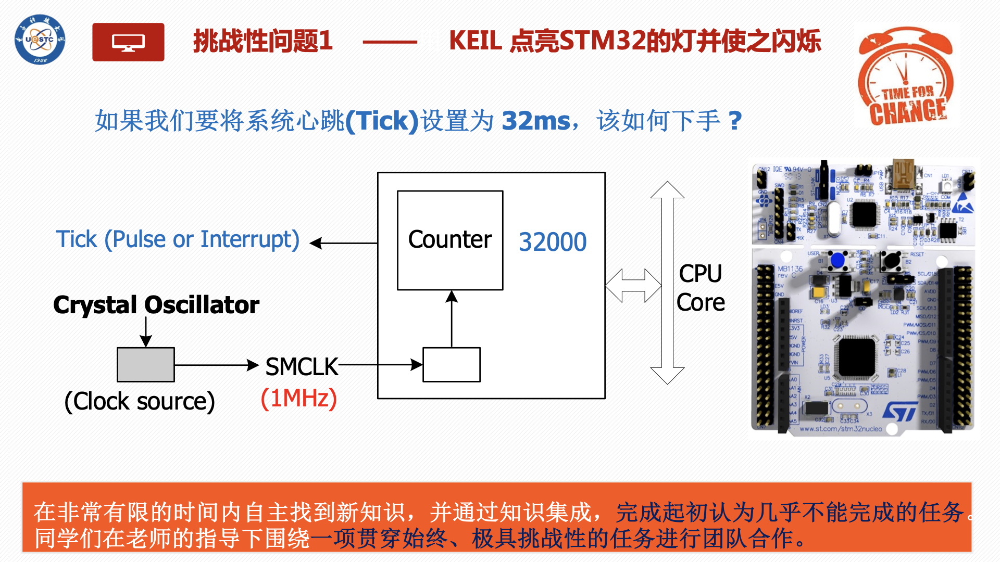

- #### 脉冲信号？

  - 我们可以将这块板子与人体做类比。时钟源之于板子，相当于心脏之于人体。人体需要心脏周期性的跳动才能正常运行，板子上的MCU、各种各样的外设等也需要一个周期性的 **Tick** 才能正常运行。

- #### 时钟…树？

  - 与人体所有组织器官都跟从一个唯一的心跳不同，STM32的每个外设都有其单独的时钟——STM32的外设繁多，每个外设所需要的最佳时钟各不相同，需要哪个开哪个，既能节省系统资源，又能提高每个外设的工作效率。
  - 于是由几个时钟源，引出了一大片外设时钟，就像一颗树一样。

  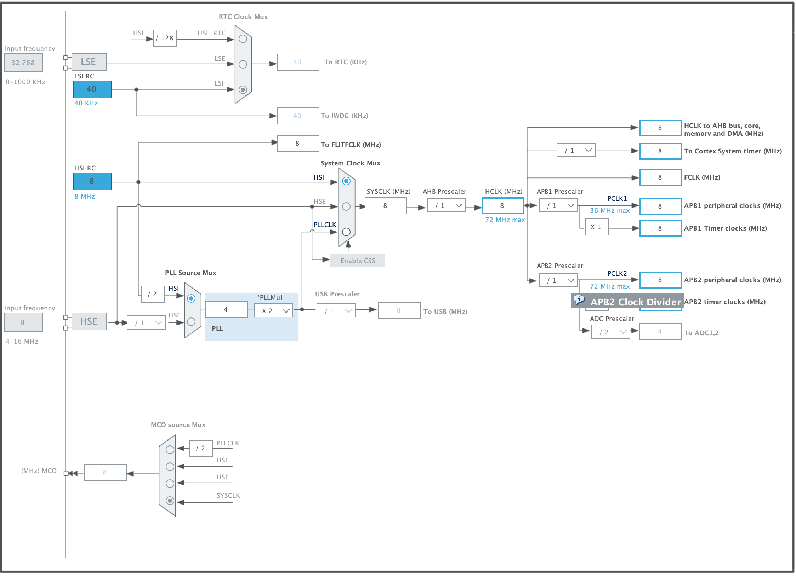


## 时钟源&时钟树

### 时钟源

#### 简介

- 时钟源是电子设备中的一个关键组成部分，用于生成稳定的时间基准信号。这些时间基准信号通常用于同步各种电子元件和系统中的操作。
  - 时钟源可以采用不同的技术，包括晶体振荡器、陶瓷谐振器、RC振荡电路等。
  - 时钟源的频率通常非常精确，用于同步微处理器、微控制器、数字电路、通信设备等各种电子系统的操作。

- ##### 两种分类标准、四种时钟源

  - 高速HS/低速LS；外置E/内置I

  - 排列组合出四种时钟源
    - HSE、LSE；HSI、LSI；

#### 选择时钟

在 ST 已经提供的 SystemInit() 函数中会按用户的选择进行时钟树的底层配置。

例如**使用外部时钟作为系统时钟**的流程是，首先开启内部高速时钟，利用内部时钟通过选择器的 HSI 脚提供时钟信号，然后开启外部时钟，其信号将经过锁相环倍频（分频的逆过程）输出到 PLLCLK，待其**稳定**之后，选择器切换过来，完成使用外部时钟提供时钟信号的过程。

- **系统时钟的选择是在启动时进行**
- 复位时内部8MHz的**RC振荡器**被选为默认的CPU时钟，随后可以选择外部的、具失效监控的4~16MHz时钟;
- 当检测到外部时钟失效时，它将被隔离，系统将自动地切换到内部的RC振荡器。

#### 配置分频？

#### PLL锁相环

### 时钟树

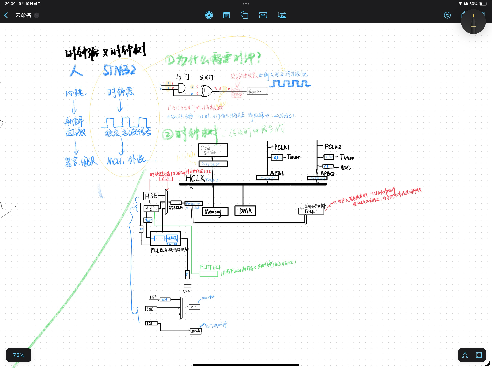

经过选择时钟源后，我们就将合适的时钟源分配到不同的时钟里去。然后时钟源便扩展出了时钟树。

- ##### 系统时钟 SYSCLK

  - AHB 总线时钟
    - AHB BUS
    - core
    - memory and DMA
    - APB2总线时钟
      - 外设
      - TIM
    - APB1总线时钟
      - 外设
      - TIM

- ##### RTC 时钟

- ##### 独立看门狗时钟

- ##### I2S 时钟

- ##### PHY 以太网时钟

- ##### USB PHY 时钟

- ##### MCO 时钟输出

- ……

## 启动

### 上电

### System INIT——配置SYSCLK到72MHZ

- 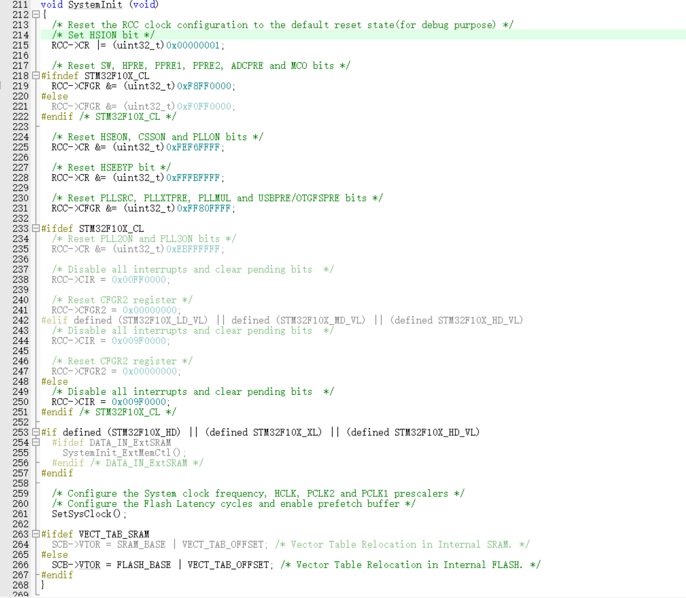

#### 开HSI

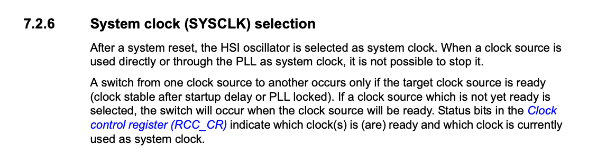

- Enable HSI first. The SHI is selected as system clock. 

  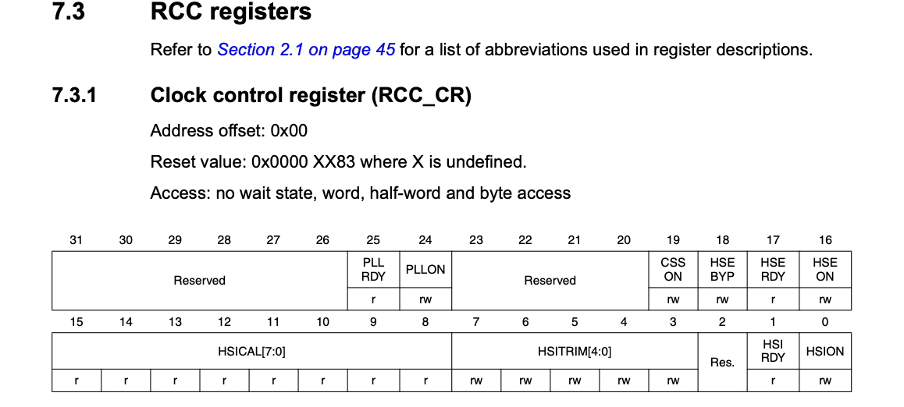

  

- Switch to other clocl source AFTER:

  - Statup Delay
  - PLL locked

  How to check?

  - Status Bits in **RCC_CR(Clock control Register)** 

    

#### 配置Prescaler

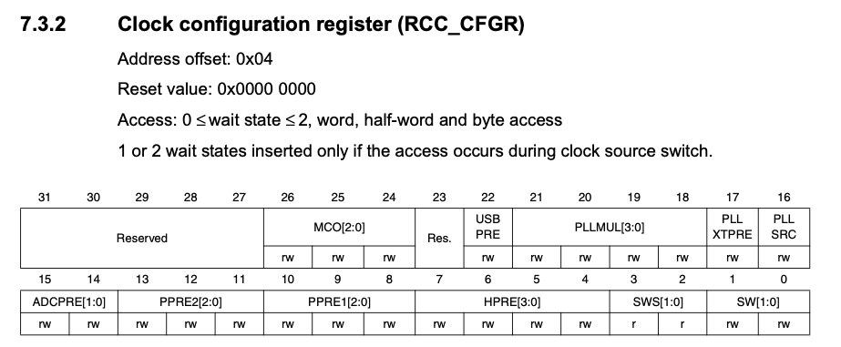

#### 更新时钟源： `SystemCoreClockUpdate()`

#### 配置好SYSCLK：`SetSysClockTo72()`

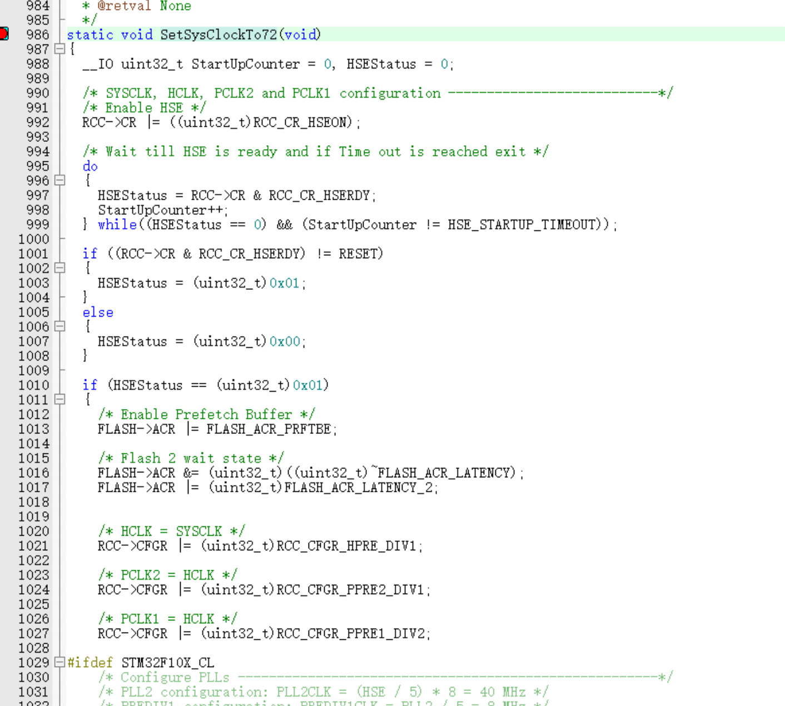

- ##### 开启HSE

  - 改RCC_CR寄存器开
  - 读取RCC_CR寄存器里的标志为检查是否ready

- ##### 配置Prescaler

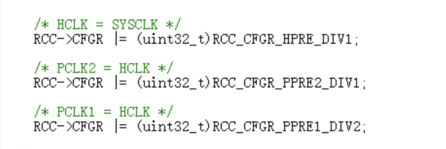
