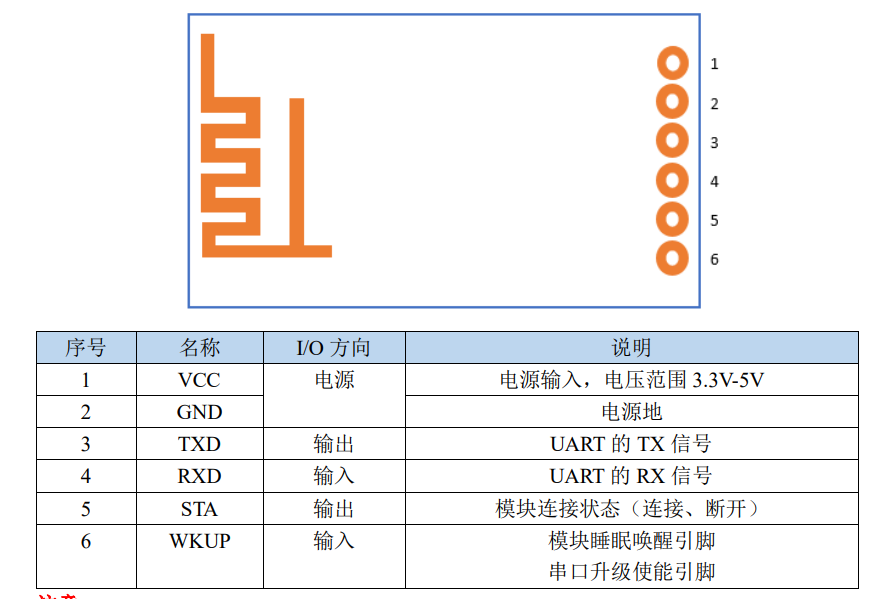
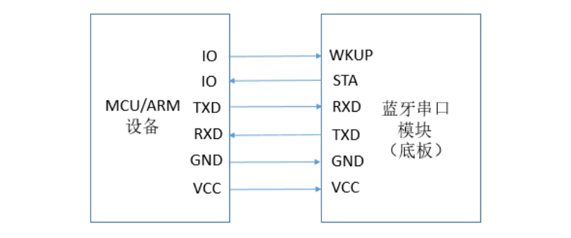
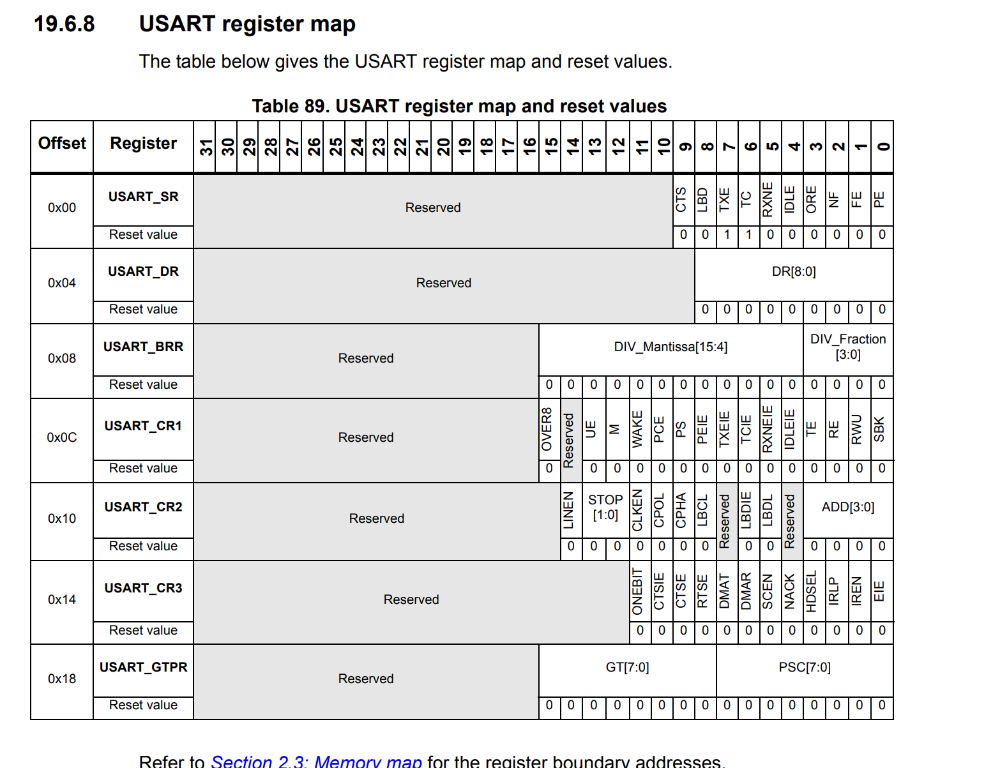
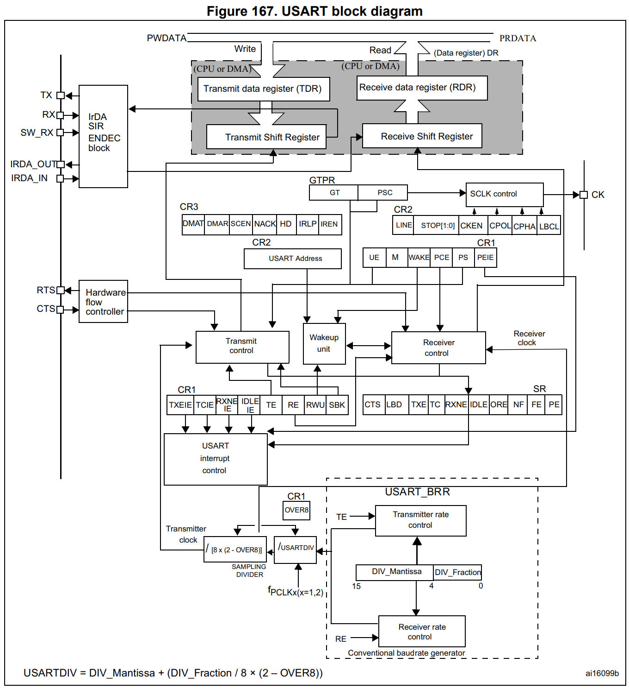
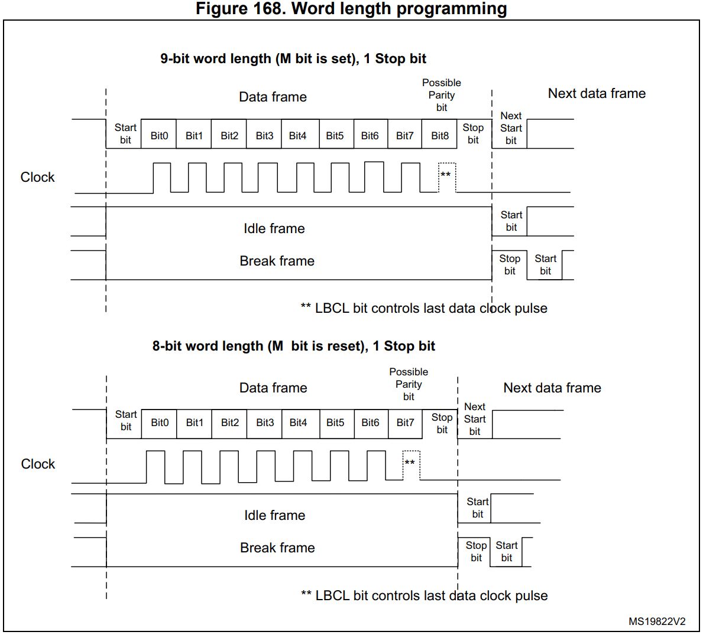
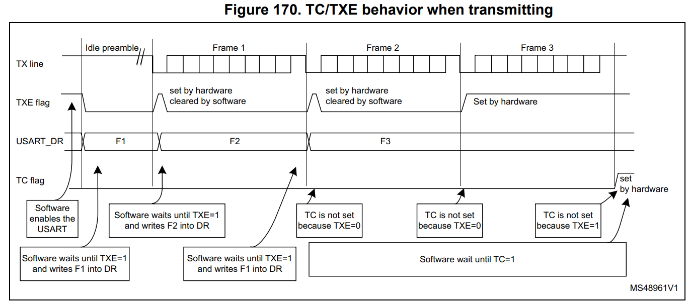
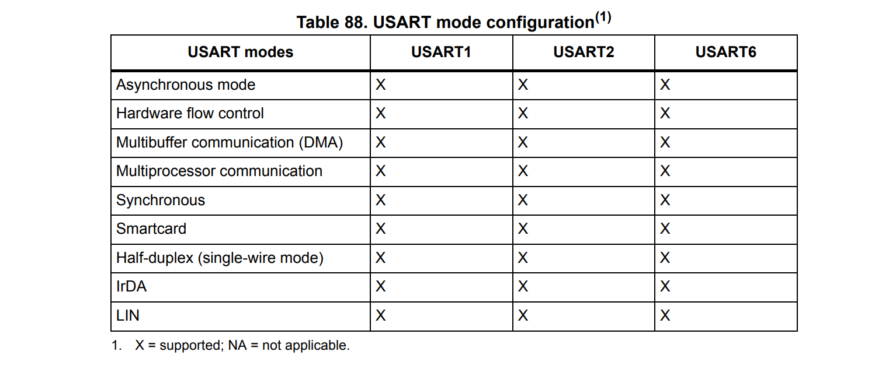

> # 挑战五
>
> **Group 3**

”裸机下驱动蓝牙模块。“

需要将GY-86的数据通过蓝牙模块传回给上位机，以供调试。

# 模块简介

我们选用了正点原子的 ATK-BLE01 蓝牙模块。

## 引脚&接线图

 

- 注意
    - 供电选择3.3v

## 工作模式

主设备模式 从设备模式 广播者模式 观察者模式 iBeacon 模式。默认为从设备模式。

目前配置的参数：

# 配置ATK-BLE01

# 配置USART串口通信

## F401REUSART资源

### Features

- 全双工/半双工，异步通信
- NRZ数据格式 
    - [工业标准NRZ异步串行数据格式【来自野火stm32_USART】](https://blog.csdn.net/wangzhe330/article/details/8684404#:~:text=%E6%AF%8F%E4%B8%80%E4%BD%8D%E7%BC%96%E7%A0%81%E5%8D%A0%E7%94%A8%E4%BA%86%E5%85%A8%E9%83%A8%E7%A0%81%E5%85%83%E7%9A%84%E5%AE%BD%E5%BA%A6%2C%E6%95%85%E8%BF%99%E4%B8%A4%E7%A7%8D%E7%BC%96%E7%A0%81%E9%83%BD%E5%B1%9E%E4%BA%8E%E5%85%A8%E5%AE%BD%E7%A0%81%2C%E4%B9%9F%E7%A7%B0%E4%BD%9C%E4%B8%8D%E5%BD%92%E9%9B%B6%E7%A0%81NRZ%20%28Non,Return%20Zero%29%E3%80%82%20%E5%A6%82%E6%9E%9C%E9%87%8D%E5%A4%8D%E5%8F%91%E9%80%81%221%22%E7%A0%81%2C%E5%8A%BF%E5%BF%85%E8%A6%81%E8%BF%9E%E7%BB%AD%E5%8F%91%E9%80%81%E6%AD%A3%E7%94%B5%E6%B5%81%3B%E5%A6%82%E6%9E%9C%E9%87%8D%E5%A4%8D%E5%8F%91%E9%80%81%220%22%E7%A0%81%2C%E5%8A%BF%E5%BF%85%E8%A6%81%E8%BF%9E%E7%BB%AD%E4%B8%8D%E9%80%81%E7%94%B5%E6%B5%81%E6%88%96%E8%BF%9E%E7%BB%AD%E5%8F%91%E9%80%81%E8%B4%9F%E7%94%B5%E6%B5%81%2C%E8%BF%99%E6%A0%B7%E4%BD%BF%E6%9F%90%E4%B8%80%E4%BD%8D%E7%A0%81%E5%85%83%E4%B8%8E%E5%85%B6%E4%B8%8B%E4%B8%80%E4%BD%8D%E7%A0%81%E5%85%83%E4%B9%8B%E9%97%B4%E6%B2%A1%E6%9C%89%E9%97%B4%E9%9A%99%2C%E4%B8%8D%E6%98%93%E5%8C%BA%E5%88%86%E8%AF%86%E5%88%AB%E3%80%82)
- 可配置的超采样率（16x/8x）
- 可配置的浮点化的波特率

- 可配置的数据位长度（8/9bit）
- 可配置的停止位长度（1/2bit）
-  LIN Master Synchronous Break send capability and LIN slave break detection  capability –
    -  13-bit break generation and 10/11 bit break detection when USART is hardware  configured for LIN

- 用于同步通信的时钟输出
- IrDA，智能卡
- 可配置的使用DMA转运
- 可针对发送与接收数据分别配置起始位
- 通信标志位
    - Receive buffer full
    - Transmit buffer empty
    - End of transmission flags

- 奇偶校验位
    - Transmits parity bit
    - Transmits parity bit
- 错误标志位
    - Overrun error 
    - Noise detection 
    - Frame error 
    - Parity error

- 中断源&标志位
    - CTS changes
    - LIN break detection
    - Transmit data register empty 
    - Transmission complete 
    - Receive data register full 
    - Idle line received
    - Overrun error 
    - Framing error  
    - Noise error 
    - Parity error
- Multiprocessor communication 
    - Enter into mute mode if address match does not occur 
    - Wake up from mute mode (by idle line detection or address mark detection) 
    - Two receiver wakeup modes: Address bit (MSB, 9th bit), Idle line

### Functional Description

至少连接两根线：TX、RX

#### RX

串行数据输入口。此口配置有超采样率以用于分辨输入信号含有含有噪声的程度。

#### TX

串行数据输出口。当串行输出被禁用时，该引脚恢复至其原来的 I/O 功能。当串行输出被使能后，若没有数据输出，该引脚默认输出高电平。

>  *In single-wire and smartcard modes, this I/O is used to transmit and  receive the data (at USART level, data are then received on SW_RX).*

通过TX和RX，串行数据将以正常的USART数据帧进行异步通信：

- 起始位
- 数据位 8-9 bits
- 终止位 0.5-2bits
- 浮点式的波特率 12位尾数+4位小数

通过以下寄存器

- 状态寄存器 USART_SR
- 数据寄存器 USART_DR
- 波特率寄存器 USART_BRR
- Guardtime寄存器 USART_GTPR -智能卡模式

想要进行同步通信，我们还需要：

#### CK

时钟信号输出。 This pin outputs the transmitter data clock for  synchronous transmission corresponding to SPI master mode (no clock pulses on start  bit and stop bit, and a software option to send a clock pulse on the last data bit). In  parallel data can be received synchronously on RX. This can be used to control  peripherals that have shift registers (e.g. LCD drivers). The clock phase and polarity  are software programmable. In smartcard mode, CK can provide the clock to the  smartcard. 

想要进行硬件流控制，我们还需要：

#### CTS

Clear To Send blocks the data transmission at the end of the current transfer (when high)

#### RTS

Request to send indicates that the USART is ready to receive a data (when low)

### 外设框图

### 数据帧

可以在 USART_CR1 寄存器里设置校验位。

### 支持的模式

