> # 挑战四~(施工中)~
>
> ##### Group 3

- 篇幅较长，建议配合大纲食用

# 预备知识

## GY-86简介

> 一个使用IIC通信的十轴姿态传感器

### Sensors

- 3-axis Gyroscope&3-axisAccelerometer-**MPU6050**
- 3-axis Magnetometer-**HMC5883L**
- Barometer-**MS5611**
    - 测量大气压强和温度

#### MPU6050

- MPU6050是一个6轴姿态传感器，可以测量芯片自身X、Y、Z轴的加速度、角速度参数，通过数据融合，可进一步得到姿态角，常应用于平衡车、飞行器等需要检测自身姿态的场景
  - 3轴加速度计（Accelerometer）：测量X、Y、Z轴的加速度
  - 3轴陀螺仪传感器（Gyroscope）：测量X、Y、Z轴的角速度

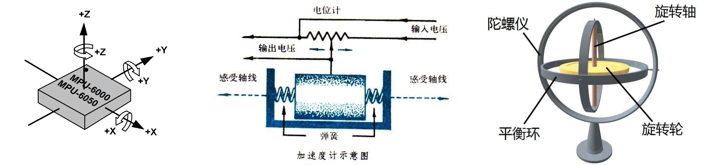

##### 飞行姿态测算

- 通过对欧拉角以及三轴加速的测算可解算出飞行器的实时姿态。


##### 器件参数

- 16位ADC采集传感器的模拟信号，量化范围：-32768~32767

- 加速度计满量程选择：±2、±4、±8、±16（g）

- 陀螺仪满量程选择： ±250、±500、±1000、±2000（°/sec）

- 可配置的数字低通滤波器

- 可配置的时钟源

- 可配置的采样分频

- •2C从机地址：1101000（AD0=0） 1101001（AD0=1）

##### 硬件电路

- 注意红框部分。这是一个旁路选择器，决定MPU6050周边外设（如HMC5883L）是直接连接到单片机的总IIC还是连接到MPU6050的IIC。

  > 在GY-86中，MPU6050是通过AUX-IIC作为Master支配HMC5883L和MS5611两个传感器的。


## IIC通信

> 基本任务
>
> 通过通信线，实现单片机读写外挂模块寄存器的功能。

### 简介

- **两根通信线**
  - SCL(Serial Clock) 
    - 任何时候，都是由主机完全掌控。从机只能读取
  - SDA(Serial Data)
    - 空闲状态主机可以主动发起对SDA的控制
    - 从机不能主动发起对SDA的控制，只有在主机发送读取从机的命令后/从机应答的时候，从机才能短暂获得

#### 特点

- 同步
  - 能降低硬件要求
  - 稳定性高于异步
  - 单片机进中断不会影响通讯
- 半双工
  - 一根SDA兼具发送与接收
- 带数据应答 
- 总线支持挂载多设备
  - 一主多从、多主多从

### 硬件电路

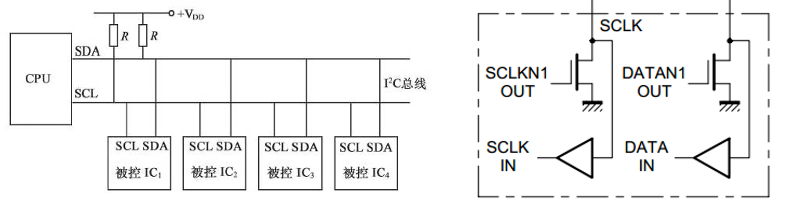

- 所有的IIC设备的SCL连一起，SDA连一起
- 设备的SCL和SDA均要配置为**开漏输出模式**，并配合**弱上拉**，即加一个上拉电阻（4.7kΩ左右）
  - SCL线（一主多从）
    - 单片机始终输出，外设时钟输入
  - SDA
    - 由于是半双工，每个设备会在输入输出之间切换——一旦没协调好，就将短路——**禁止所有设备输出强上拉的高电平，采用外置弱上拉电阻加开漏输出的电路结构**
      - 所以在每个引脚输出低电平时，直接导通接地，为强下拉；每个引脚输出高电平时，直接断开，为浮空状态，由外部V~DD~加上拉电阻构成弱上拉高电平。
  - 开漏+弱上拉 即可达成同时输入输出。还能避免频繁切换引脚模式
  - 会有一种“线与”的现象：只要有任意一个或者多个设备输出了低电平，总线就处于低电平。只有所有的设备都输出高电平才会使总线处于高电平
    - 这就是IIC执行多主机模式下的时钟同步和总线仲裁的方案。因此，在单主机下，SCL对可以使用PushPULL，但还是使用了开漏模式

### 时序单元

#### 起始终止

> 类似于串口时序里的起始位和停止位

- ##### 起始条件：SCL高电平期间，SDA从高电平切换到低电平

- ##### 终止条件：SCL高电平期间，SDA从低电平切换到高电平

- ##### 空闲状态：SCL与SDA均处于高电平状态

  - 之后会保证：除了起始和终止状态，每个时序单元的SCL都是以低电平开始，低电平结束

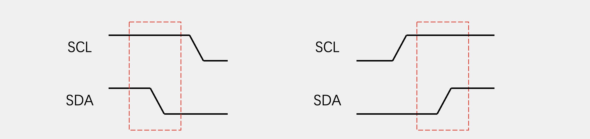

  此外，仅有主机能够产生起始和终止信号，所以在总线空闲状态时，从机必须始终双手放开，否则就是多主机模式了。

#### 发送字节

- #### 步骤

1. 在SCL低电平期间，主机将数据位依次放到SDA线上**（高位先行，和串口相反）**

   - 下拉SDA使其为低电平代表为0
   - 松开SDA使其回到高电平代表 1

2. 释放SCL，使其处于**弱上拉**的高电平状态

3. 从机将在**SCL高电平**时读取数据位

   > **所以在SCL高电平期间不允许SDA由数据位变化**，否则就变成起始/终止信号了

4. 循环八次，即可发送一个字节

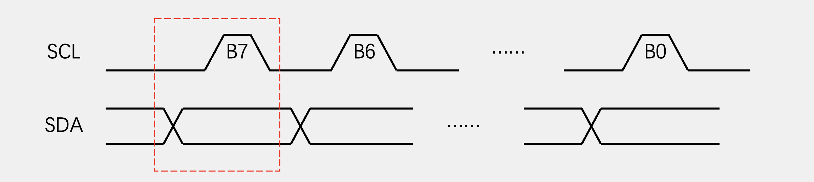

- 起始条件后，第一个字节必须由主机发送  

#### 接收字节

- #### 步骤

1. SCL 低电平期间，从机将数据位依次放到SDA上**（高位先行，和串口相反）**

2. 释放SCL，使其处于**弱上拉**的高电平状态

3. 主机将在**SCL高电平**时读取数据位

   > **所以在SCL高电平期间不允许SDA由数据位变化**，否则就变成起始/终止信号了

4. 循环八次，即可接收一个字节


#### 应答

电路变化同发送/接收字节，区别是前者只发送/接收一位，而后者时发送/接收八位，构成一个字节。

- ##### 发送应答：主机在接收完一个字节之后，在下一个时钟发送一位数据。

  - 数据0表示应答，数据1表示非应答

- ##### 接收应答：主机在发送完一个字节之后，在下一个时钟接收一位数据。

  - 数据0表示应答，数据1表示非应答

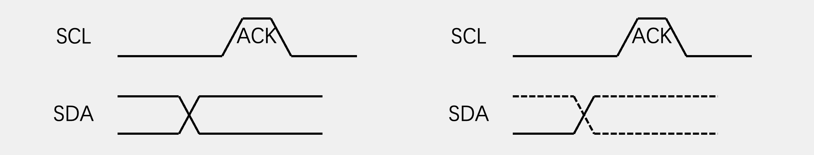

### 数据帧

**起始信号+从机地址(7/10bit)+读写操作标志位(1bit)+数据+终止信号**

首先首先把每个从设备都确定一个唯一的设备地址。主机在起始条件之后，要先发送一个字节确定需要控制的从机。所有的从机都会收到第一个字节，和自己的地址进行比较。

从机设备地址，在IIC协议里分为7位地址和10位地址。前者应用范围最广。在每个IIC设备出场时，厂家都会为它分配一个7位地址，可以在芯片手册里查到。例如MPU6050的地址就是`1101000`。同一种芯片的地址都是一样的，但是器件地址的最后几位是可以在电路中改变的。比如MPU6050地址的最后一位就可以这个板子上的AD0引脚确定。

对于读写标识位，0表示主机将对从机进行写入操作，1表示进行读取操作

下面是几种时序：

#### 指定地址写

- ##### 对于指定设备，在指定的地址下写入指定的数据

  - 指定设备，通过从机地址Slave Address确定
  - 指定地址，是某个设备内部寄存器的地址RegAddress

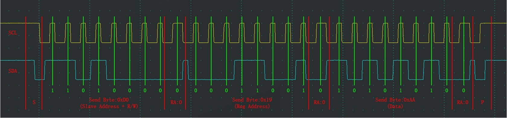

-空闲-|起始|-------------从机地址------------写-|应 答|-发送数据（将要操作的地址）-|应答|------------------数据------------------|应答|结束|-----

#### 当前地址读

- ##### 对于指定设备，在当前地址指针指示的地址下读取从机数据

  - 指定设备，通过从机地址Slave Address确定

  - 当前地址指针

    - 在从机中，所有的寄存器被分配到了一个线性区域中，并且会有一个单独的指针变量指向其中一个寄存器。
    - 该指针上电默认指向0。并且每写入和读出一个字节后，这个指针就会自动自增一次，移动到下一个位置。
    - 当处于当前地址读模式下，主机没有指定读取的地址，从机就会返回当前指针指向的寄存器的值。

    > 例如上一图中调用了 `0x19` 寄存器，那么下图就是读取 `0x1A` 寄存器的值了。

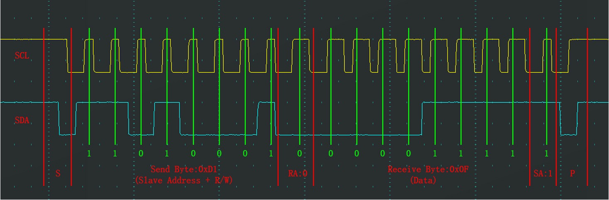

---空闲---| 起始｜-----------------------从机地址--------------------读-|从机应答|---------------------主机接收数据--------------------|主机应答|终止|----

#### 指定地址读

- ##### 对于指定设备，在指定地址下读取从机数据

  -  是将 *指定地址写* 的一部分和 *当前地址读* 二者合并在一起。

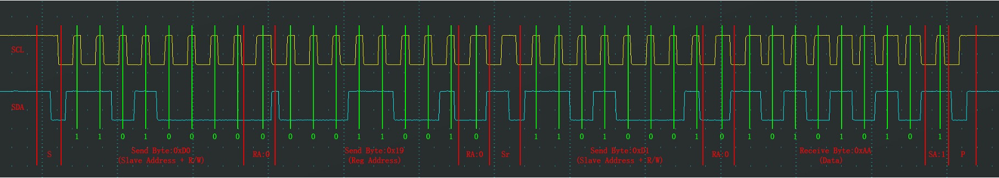

------|起|-------------从机地址---写-|答|----**某寄存器地址**------**读**-|答｜**再起**|-----从机地址--------------|应答|---**“某寄存器”的下一个**--|答|终|-

- **再起**是因为读写标识位所在字节只能跟在起始标识后。

- **某寄存器”的下一个**是因为指针自增

#### 读取多字节

- 上方法 **Send Byte** 和 **Receive Byte** 重复几次即可
- **注意每操作一个寄存器，指针就会自动+1！！！**
- 主机发完从机要回复**应答**
- 从机每发一个字节主机要回复**应答**，地址指针会自动自增，继续发下一个寄存器的值。从机多字节发完主机要回复**非应答**


# 驱动GY-86

- 大致有以下几个步骤
  
  - 阶段一：使用标准库函数书写
  
    - 新建工程
  
    - 书写软件IIC协议函数（ `IIC.c` 和 `IIC.h` ）
       1. GPIO口初始化
       2. 起始/终止
       3. 发送/接收数据
       4. 发送/接收应答
  
    - 书写MPU6050驱动函数
       1. 读/写指定寄存器
       2. AUX-IIC的Master&Bypass配置
  
          > GY-86默认 单片机作为主机控制 MPU6050，MPU6050通过AUXIIC作为主机控制MHC5883L和MS5611
  
    - 书写HMC5883L驱动函数
  
    - 书写MS5611驱动函数
  
  - 阶段二：转换为汇编语言书写底层驱动

## 新建工程

- 空白工程建立参见 Firmware/Reference/新建工程.md

- 建立新Group `Hardware` 装载如下文件

  

## 软件模拟IIC

我们使用软件模拟IIC通信，可以较随意的指定GPIO口，也能很好的规避使用硬件IIC时不同厂商硬件IIC的兼容问题。在本工程中，我们指定的端口如下：

``` c
/* Defines -------------------------------------------------------------------*/ 
#define SCL_PORT   GPIOB
#define SCL_PIN    GPIO_Pin_8

#define SDA_PORT   GPIOB
#define SDA_PIN    GPIO_Pin_9
```

- 这里将**分层**编写软件IIC的驱动：

  - 底层
    - IIC的初始化：对GPIO口的初始化配置
    - 置SCL/SDA的电平
    - 读SCL/SDA的电平
  - 协议层
    - 产生起始/终止条件
    - 发送/读取单个字节
    - 发送/读取应答位
  - 应用层
    - 根据不同模块，编写对应的IIC数据帧来操作寄存器，比如指定地址读，指定地址写。

  > 分层编写函数，再按照需求逐层封装。这样在编写函数时能专注于当前层的逻辑思维，提高编程效率与程序可移植性。

### 底层

#### `MyIIC_Init`函数

- 我们使用软件IIC模拟通信协议，这里需要选择两个GPIO口

  - 开启对应总线上的时钟，可在 **Reference Manual** 中的 **Meomory Map** 中查询。
  - 初始化为**开漏输出**
  - 拉高两针脚电平

  > MPU6050模块已经内置上拉电阻

``` c
void MyIIC_Init(void)
{
	//初始化PB8和PB9作为模拟SCL与SDA
	GPIO_InitTypeDef GPIO_InitStructure;
	RCC_AHB1PeriphClockCmd(RCC_AHB1Periph_GPIOB, ENABLE);
	GPIO_InitStructure.GPIO_Pin = GPIO_Pin_8 | GPIO_Pin_9;
	GPIO_InitStructure.GPIO_Speed = GPIO_Speed_100MHz;
	GPIO_InitStructure.GPIO_Mode = GPIO_Mode_OUT;
	GPIO_InitStructure.GPIO_OType = GPIO_OType_OD;
	GPIO_Init(GPIOB, &GPIO_InitStructure);
  
	GPIO_SetBits(GPIOB,GPIO_Pin_8 | GPIO_Pin_9);
	
}
```

#### 读/写 SCL/SDA 上的电平

- 写SCL和SDA两根线上的电平
  - `GPIO_WriteBit`函数内使用宏定义，以增加可读性与可移植性；也可以使用宏函数的方案。
  - 延时10us，防止电平变化太快导致从机接受不到。具体延时时长可参考MPU6050的IIC特性说明。

``` c
void MyIIC_W_SCL(uint8_t BitValue)
{
	GPIO_WriteBit(SCL_PORT,SCL_PIN,(BitAction)BitValue);
	Delay_us(10);
}
```

``` c
void MyIIC_W_SDA(uint8_t BitValue)
{
	GPIO_WriteBit(SDA_PORT,SDA_PIN,(BitAction)BitValue);
	Delay_us(10);
}
```

- 读SCL和SDA两根线上的电平

``` c
uint8_t MyIIC_R_SCL(void)
{
	uint8_t BitValue;
	BitValue = GPIO_ReadInputDataBit(SCL_PORT,SCL_PIN);
	Delay_us(10);
	return BitValue;
}
```

``` c
uint8_t MyIIC_R_SDA(void)
{
	uint8_t BitValue;
	BitValue = GPIO_ReadInputDataBit(SDA_PORT,SDA_PIN);
	Delay_us(10);
	return BitValue;
}
```

### 协议层

> 除了终止状态，每个例程结束后SCL均处于低电平状态。

#### 起始/终止

``` c
void MyIIC_Start(void)
{
	//注意，此处需要先释放SDA。考虑到重复起始条件Sr，如果先释放SCL会引起歧义（因为SCL起始是低电平，可能被理解为终止条件）
	MyIIC_W_SDA(1);
	MyIIC_W_SCL(1);
	MyIIC_W_SDA(0);
	MyIIC_W_SCL(0);
}	

void MyIIC_Stop(void)
{
	//先拉低SDA保证为低电平
	MyIIC_W_SDA(0);
	MyIIC_W_SCL(1);
	MyIIC_W_SDA(1);
}
```

#### 发送/接收字节

``` c
void MyIIC_SendByte(uint8_t Byte)
{
	//从高到低发送Byte到SDA线缆上
	//取出最高位（从左到右数第一个数字）
	for(uint8_t i=0; i<8; i++)
	{
		MyIIC_W_SDA(Byte & (0x80 >> i)); //经典操作，也可以使用Byte>>7
		MyIIC_W_SCL(1);
		MyIIC_W_SCL(0);
	}
	
}
```

``` c
uint8_t MyIIC_ReceiveByte(void)
{
	uint8_t Byte = 0x00;
	//主机释放SDA，交由从机控制
	MyIIC_W_SDA(1);
	//释放SDA后可以加一个延时，防止SCL释放后从机还没发出数据
	
	for(uint8_t i = 0; i <8; i++)
	{
		//拉高SCL，在SCL高电平期间读写
		MyIIC_W_SCL(1);
		if(MyIIC_R_SDA()==1) {Byte|=(0x80 >> i);}
		MyIIC_W_SCL(0);
	}
	return Byte; 
}
```

#### 发送/接收应答

``` c
void MyIIC_SendACK(uint8_t AckBit)
{
	MyIIC_W_SDA(AckBit); //经典操作，也可以使用Byte>>7
	MyIIC_W_SCL(1);
	MyIIC_W_SCL(0);
}
```

``` c
uint8_t MyIIC_ReceiveACK(void)
{
	uint8_t AckBit;
	MyIIC_W_SDA(1);
	MyIIC_W_SCL(1);
	AckBit = MyIIC_R_SDA();
	MyIIC_W_SCL(0);
		
	return AckBit;
}
```

至此，IIC驱动的函数已经完成。编写 `MyIIC.h` 与 `MyIIC.c` 后即可正常调用。

### 应用层

这里将根据不同模块寄存器的特点编写相应的**发送/读取数据帧函数**

#### MPU6050

这两个函数存放在 `MPU6050.c` 中，实现了**指定地址写**与**指定地址读**。

``` c
void MPU6050_WriteRegister(uint8_t RegAddress, uint8_t Data)
{
	MyIIC_Start();
	MyIIC_SendByte(MPU6050_ADDRESS);
	MyIIC_ReceiveACK();
	MyIIC_SendByte(RegAddress);
	MyIIC_ReceiveACK();
	MyIIC_SendByte(Data);
	MyIIC_ReceiveACK();
	MyIIC_Stop();
}
```

``` c
uint8_t MPU6050_ReadRegister(uint8_t RegAddress)
{
	uint8_t Data;
	MyIIC_Start();
	MyIIC_SendByte(MPU6050_ADDRESS);
	MyIIC_ReceiveACK();
	MyIIC_SendByte(RegAddress);    //该地址将被赋给MPU6050的地址指针
	MyIIC_ReceiveACK();
	//再起始，转写为读
	MyIIC_Start();
	MyIIC_SendByte(MPU6050_ADDRESS | 0x01);
	MyIIC_ReceiveACK();
	Data = MyIIC_ReceiveByte();
	MyIIC_SendACK(1);
	MyIIC_Stop();
	
	return Data;
}
```

## 驱动MPU6050

通过IIC通信，读写MPU6050的相关寄存器，实现读取加速度计、陀螺仪并控制HMC5883L和MS5611。

需要用到的寄存器以及地址：（原文参见 **RM-MPU-6000A.pdf** 中的 **Register Map**）

``` c
//分频器配置
#define	MPU6050_SMPLRT_DIV		0x19
//CONFIG系列
#define	MPU6050_CONFIG		  	0x1A
#define	MPU6050_GYRO_CONFIG		0x1B
#define	MPU6050_ACCEL_CONFIG	0x1C
//加速度计、温度计、磁力计输出的数据
#define	MPU6050_ACCEL_XOUT_H	0x3B
#define	MPU6050_ACCEL_XOUT_L	0x3C
#define	MPU6050_ACCEL_YOUT_H	0x3D
#define	MPU6050_ACCEL_YOUT_L	0x3E
#define	MPU6050_ACCEL_ZOUT_H	0x3F
#define	MPU6050_ACCEL_ZOUT_L	0x40
#define	MPU6050_TEMP_OUT_H		0x41
#define	MPU6050_TEMP_OUT_L		0x42
#define	MPU6050_GYRO_XOUT_H		0x43
#define	MPU6050_GYRO_XOUT_L		0x44
#define	MPU6050_GYRO_YOUT_H		0x45
#define	MPU6050_GYRO_YOUT_L		0x46
#define	MPU6050_GYRO_ZOUT_H		0x47
#define	MPU6050_GYRO_ZOUT_L		0x48
//电源配置
#define	MPU6050_PWR_MGMT_1		0x6B
#define	MPU6050_PWR_MGMT_2		0x6C
//ID
#define	MPU6050_WHO_AM_I		  0x75
```

### 电源配置——POWER系列

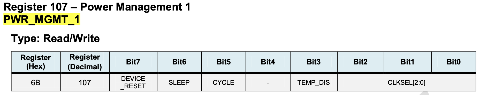

#### 解除睡眠

MPU6050 芯片上电默认睡眠模式，无法操作寄存器，只能读取 WHO_AM_I 寄存器获得其IIC地址号。

#### 选择时钟源

MPU6050有三个时钟源：内置8MHz、内置陀螺仪时钟、外部时钟。手册强烈推荐选择内置陀螺仪时钟。

- 其余不需要变更。参考手册说明，得出该寄存器应该填入 `0000 0001`


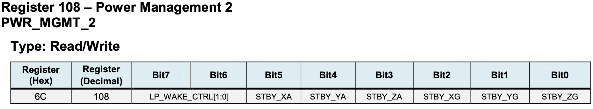

- 该寄存器用于配置低功耗下的唤醒频率以及加速度计和磁力计的睡眠模式。均不需要变动，得出该寄存器应该填入 `0000 0000`


### 基础配置——CONFIG系列

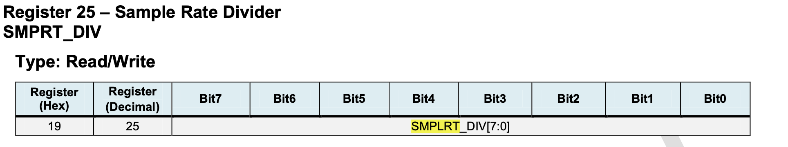

#### 配置分频器

配置的分频系数越小，采样率越高，数据刷新越快。具体值根据需求决定，这里设置为 `0000 1001`


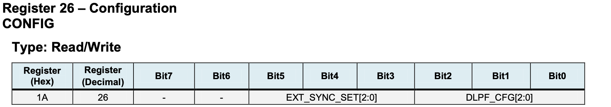

- 不需要配置外部同步 EXT_SYNC

#### 配置低通滤波 DLPF_CFG

随着低通滤波变高，数据变化的将更加平滑。具体值根据需求决定，这里设置为 `0000 0110`


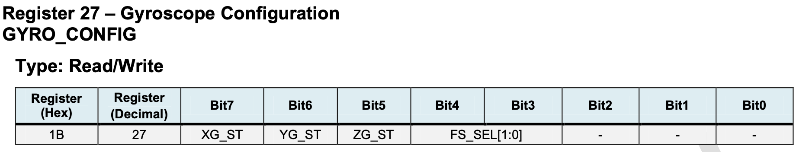

#### 陀螺仪自测 X/Y/ZG_ST

设置为0，不用使能。自测是MPU6050模拟一个外部力场，读出一个数据，与手册上的参考值相比较，在允许的误差范围内即代表该模块并未损坏

#### 陀螺仪满量程选择 FS_SEL

| FS_SEL | 满量程       |
| ------ | ------------ |
| 00     | ± 250 度/秒  |
| 01     | ± 500 度/秒  |
| 10     | ± 1000 度/秒 |
| 11     | ± 2000 度/秒 |

根据项目实际需求选择，量程越小精度越高。


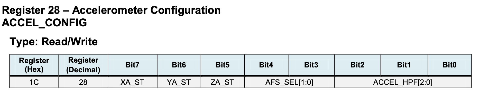

#### 加速度计自测

同上。

#### 加速度计满量程选择 AFS_SEL

| AFS_SEL | 满量程 |
| ------- | ------ |
| 00      | ± 2g   |
| 01      | ± 4g   |
| 10      | ± 8g   |
| 11      | ± 16g  |

#### 加速度计高通滤波器

MPU6050通常允许你配置高通滤波器的截止频率，以满足特定应用的需求。较高的截止频率会滤除更多低频分量，但可能会导致数据损失，因此需要权衡。高通滤波器是一个重要的工具，用于提高IMU（惯性测量单元）的性能，特别是在需要高精度姿态估计和动态运动检测的应用中。根据具体项目确定，此处先默认设置为关闭（000）。


至此，即可书写MPU6050的初始化函数了：

``` c
void MPU6050_init(void)
{
	MyIIC_Init(); //在这里调用函数初始化IIC，有点类的继承的感觉
	//解除睡眠,选择时钟（陀螺仪时钟）
	MPU6050_WriteRegister(MPU6050_PWR_MGMT_1  ,0x01);
	MPU6050_WriteRegister(MPU6050_PWR_MGMT_2  ,0x00);
	//选择分频，越小刷新越快
	MPU6050_WriteRegister(MPU6050_SMPLRT_DIV  ,0x09);
	//外部同步以及低通滤波
	MPU6050_WriteRegister(MPU6050_CONFIG      ,0x06);
	//陀螺仪 自测不使能，最大量程选择
	MPU6050_WriteRegister(MPU6050_GYRO_CONFIG ,0x18);
	//加速度 自测不使能，最大量程选择，高通滤波器
	MPU6050_WriteRegister(MPU6050_ACCEL_CONFIG,0x18);
}
```

### 读取数据

简单的调用上面**软件模拟IIC**中应用层编写好的读取寄存器函数即可。返回值是16位的，需要两个寄存器装载，于是这些寄存器最后的字母 H/L 即代表 高/低 八位。根据手册得知，MPU6050是以补码的形式返回数据。

``` c
void MPU6050_GetData(int16_t *AccX,int16_t *AccY,int16_t *AccZ,int16_t *GyroX,int16_t *GyroY,int16_t *GyroZ)
{
	int16_t DataH,DataL;

	DataH = MPU6050_ReadRegister(MPU6050_ACCEL_XOUT_H);
	DataL = MPU6050_ReadRegister(MPU6050_ACCEL_XOUT_L);
	*AccX = (DataH << 8) | DataL;

	DataH = MPU6050_ReadRegister(MPU6050_ACCEL_YOUT_H);
	DataL = MPU6050_ReadRegister(MPU6050_ACCEL_YOUT_L);
	*AccY = (DataH << 8) | DataL;

	DataH = MPU6050_ReadRegister(MPU6050_ACCEL_ZOUT_H);
	DataL = MPU6050_ReadRegister(MPU6050_ACCEL_ZOUT_L);
	*AccZ = (DataH << 8) | DataL;

	DataH = MPU6050_ReadRegister(MPU6050_GYRO_XOUT_H);
	DataL = MPU6050_ReadRegister(MPU6050_GYRO_XOUT_L);
	*GyroX = (DataH << 8) | DataL;

	DataH = MPU6050_ReadRegister(MPU6050_GYRO_YOUT_H);
	DataL = MPU6050_ReadRegister(MPU6050_GYRO_YOUT_L);
	*GyroY = (DataH << 8) | DataL;

	DataH = MPU6050_ReadRegister(MPU6050_GYRO_ZOUT_H);
	DataL = MPU6050_ReadRegister(MPU6050_GYRO_ZOUT_L);
	*GyroZ = (DataH << 8) | DataL;
}
```


至此，MPU6050的数据已能正常读取，写下来完成磁力计和气压计的工作。

# 遭遇的报错

- #### [[keil]L6200E: Symbol XXX multiply defined .O...错误解决方法](https://blog.csdn.net/MoreXD/article/details/121979087)

  - 原因：在头文件中定义了一个数组。
