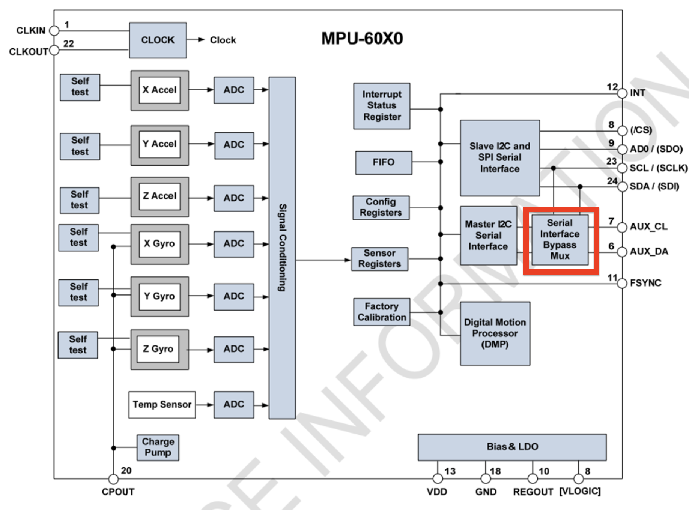
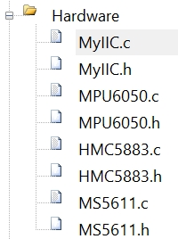

> # 挑战四
>
> ##### Group 5

# GY-86

> 十轴姿态传感器

## Sensors

- 3-axis Gyroscope&3-axisAccelerometer-**MPU6050**
- 3-axis Magnetometer-**HMC5883L**
- Barometer-**MS5611**
    - 测量大气压强和温度

### MPU6050

- MPU6050是一个6轴姿态传感器，可以测量芯片自身X、Y、Z轴的加速度、角速度参数，通过数据融合，可进一步得到姿态角，常应用于平衡车、飞行器等需要检测自身姿态的场景
  - 3轴加速度计（Accelerometer）：测量X、Y、Z轴的加速度
  - 3轴陀螺仪传感器（Gyroscope）：测量X、Y、Z轴的角速度

#### 飞行姿态测算

- 通过对欧拉角以及三轴加速的测算可解算出飞行器的实时姿态。

#### 器件参数

- 16位ADC采集传感器的模拟信号，量化范围：-32768~32767

- 加速度计满量程选择：±2、±4、±8、±16（g）

- 陀螺仪满量程选择： ±250、±500、±1000、±2000（°/sec）

- 可配置的数字低通滤波器

- 可配置的时钟源

- 可配置的采样分频

- •2C从机地址：1101000（AD0=0） 1101001（AD0=1）

#### 硬件电路

- 注意红框部分。这是一个旁路选择器，决定MPU6050周边外设（如HMC5883L）是直接连接到单片机的总IIC还是连接到MPU6050的IIC。

  > 在GY-86中，MPU6050是通过AUX-IIC作为Master支配HMC5883L和MS5611两个传感器的。

# 驱动GY-86

- 大致有以下几个步骤
  1. 新建工程
  2. 书写软件IIC协议函数（ `IIC.c` 和 `IIC.h` ）
     1. GPIO口初始化
     2. 起始/终止
     3. 发送/接收数据
     4. 发送/接收应答
  3. 书写MPU6050驱动函数
     1. 读/写指定寄存器
     2. AUX-IIC的Master&Bypass配置
  4. 书写HMC5883L驱动函数
  5. 书写MS5611驱动函数
- 大致阶段
  - 库函数实现功能
  - 转换为汇编语言

## 新建工程

- 空白工程建立参见 Firmware/Reference/新建工程.md

- 建立新Group `Hardware` 装载如下文件

   

## `MyIIC.c/h`
