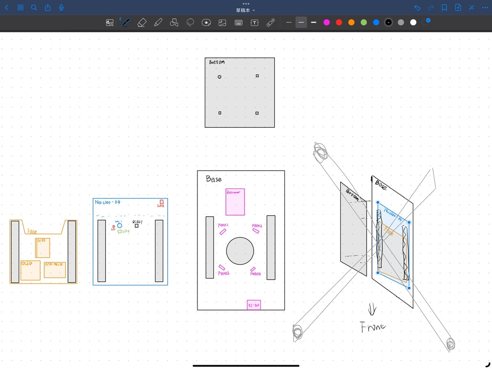
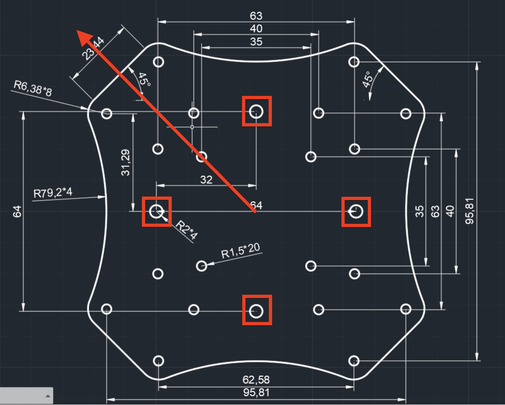
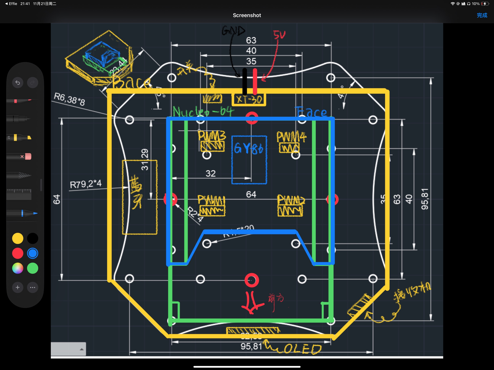

# 转接板绘制

## 概览

## Base板

### 预期目标

- ###### 与F450机架上层板形状大体类似

- ###### 哑光黑色表面

- ###### LED？

- ###### XT30供电

- ###### PWM*4 藏在Nucleo板子下面，Base板中间钻孔

- ###### 接收机

- ###### 蓝牙模块

- ###### 3.3v供电层？

### 尺寸

 
