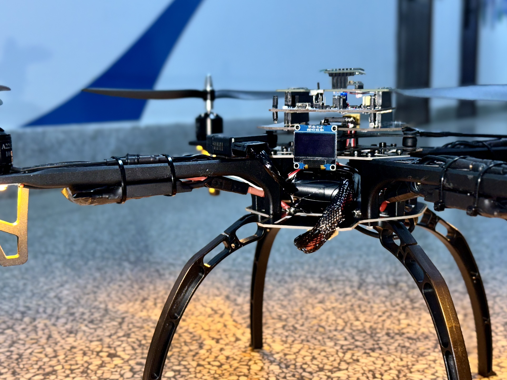
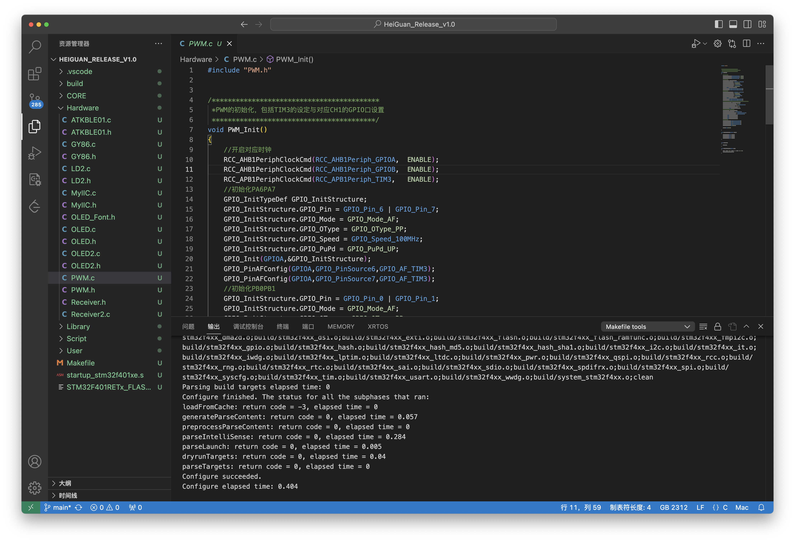
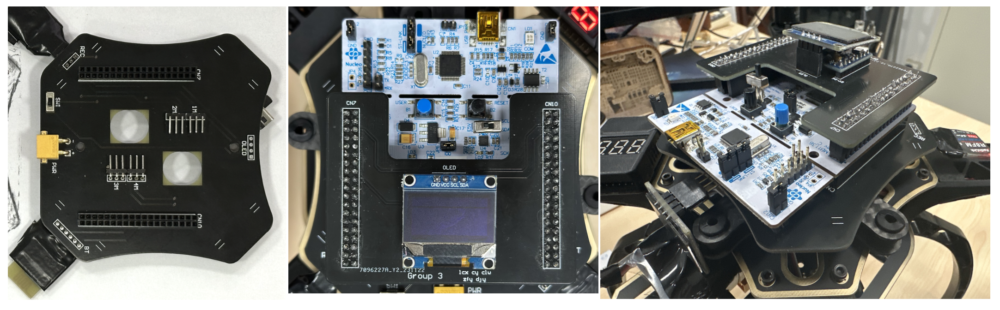

> # 黑鹳_Group3
>
> 第三组的四轴飞行器Github仓库~

- 本main分支仅存放已经调试好的Release版本，请前往 `develop` 分支查看开发中的工程、笔记、参考手册等文件

# HeiGuan_Release_v1.0

## 固件

> ./Firmware/Heiguan_Release_v1.0

- 完成了第一学期的既定任务后的版本

- 开发环境

  - 操作系统：macOS14、Windows11

  - 编辑器：Vscode

  - Toolchain：**GNU Armmbedded Toolchain**、**OpenOCD**

  - 烧录：ST-Link

    

## 飞控板

> 

- STM32F401-Nucleo64 + 双层转接板
- 开发环境
  - 操作系统：Windows11
  - 软件：Altium Designer 20
  - 制版厂商：嘉立创

