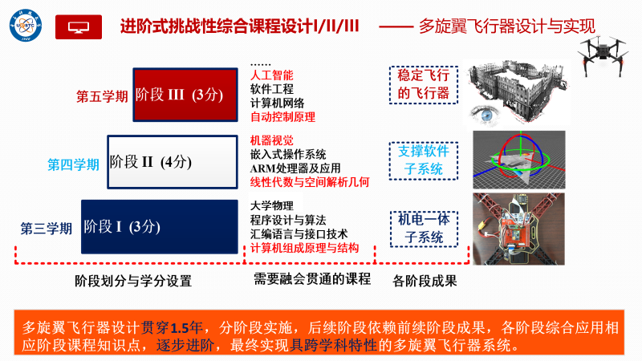
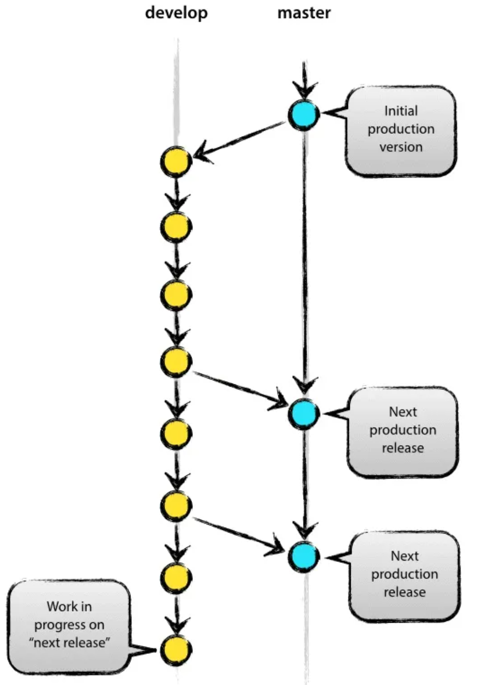
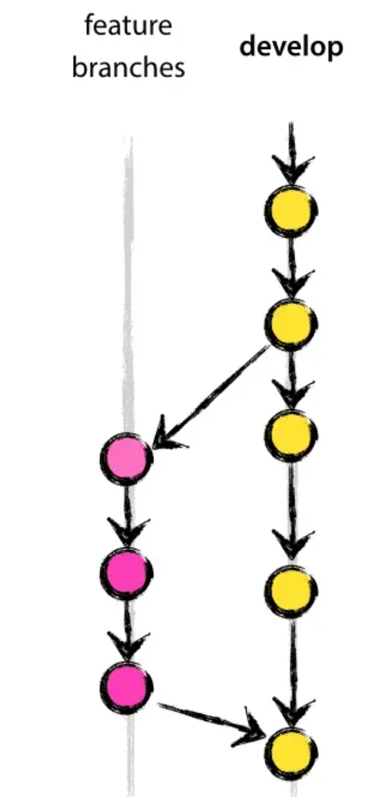

> # Quadcopter_Group3
>
> 第三组的四轴飞行器Github仓库~

# 进阶式挑战性综合课程设计

## 挑战点

### 阶段一

- ~~用 KEIL5 点亮STM32的灯并使之闪烁（汇编实现）~~
- ~~使用 Altium Designer 设计 STM32 硬件原理图~~
- ~~使用 Altium Designer 设计 STM32 PCB板图~~
- ~~裸机下驱动姿态传感器 GY-86~~
- ~~裸机下驱动蓝牙模块~~
- ~~裸机下驱动电机~~
- ~~使用 Altium Designer 完成四轴飞行器转接板原理图及PCB图设计与制作~~
- ~~硬件子系统接受并解析遥控器命令~~
- ~~启动硬件子系统~~
- ~~在自己设计的硬件系统上实现裸机软件集成~~

---

---

### 阶段二

- 用KEIL重构uc/OS II 新工程
- ARM STM-32 事件驱动机制
- ARM STM-32 时间驱动机制
- 启动ARM STM-32
- 任务上下文切换
- uc/OS II 在STM32上的移植 Pt.I
- uc/OS II 在STM32上的移植 Pt.II
- 应用子系统设计/System View与任务级调试
- 系统工程重构与优化
- 内核资源互斥访问机制
- 用MakeFile构建自己的工程

### 阶段三

> “前面的区域，以后再来探索吧!"

## 器件模块

| 器件            | 型号                                        |
| --------------- | ------------------------------------------- |
| 机架            | F450                                        |
| 主控板          | STM32F401RE @16MHz                          |
| 加速度计&陀螺仪 | MPU6050（集成于GY-86）                      |
| 磁力计          | MHC5883L（集成于GY-86）                     |
| 蓝牙            | *正点原子ATK-BLE01*                         |
| 遥控器          | RadioLink T8S（BT）                         |
| 接收器          | RadioLink R8FM                              |
| 电机            | XXD 2212 100KV                              |
| 电调            | SkyWalker 30A                               |
| 螺旋桨          | *待定*                                      |
| 电池            | 格式 3S 2200mAh 30C                         |
| 转接板          | 使用 Altium Designer 自行制作（AD真难用啊） |

## TODOs

- 2023.9.1
    - ~~购买 STM32F401RE~~
    - ~~购买 GY-86~~
    - ~~汇编点灯~~
    
- 2023.9.27
    - ~~建好GitHub仓库~~
    - ~~转接板原理图&PCB绘制~~
    - ~~选购蓝牙模块~~
    - ~~使用库函数让GY-86正常运行~~
    - ~~IIC~~
    
- 2023.10.11
    - ~~蓝牙模块驱动~~
    - ~~上位机通过蓝牙读取到GY-86返回的参数~~
    
- 2023.11.13

    > 给半期考试预留的时间似乎多了些，项目进展有些慢了: (

    - ~~采购：机架、遥控器、电机、电池、稳压模块~~
    - ~~转接板V2.0~~
    - python串口输出可视化图形探索 
    - ~~电机驱动~~
    - ~~遥控器驱动~~
    - ~~硬件子系统整合~~

- 2023.11.27

    - 尽可能改写为调用汇编函数
    - 期末答辩预备——拿下高高的分！！！
    - 探索FreeRTOS的部署

## Trouble

- ~~找不到F4的库函数  :（~~
- ~~呜呜呜GY_init()函数进不去呜呜呜呜~~

# Repository - Quadcopter_Group3

> Group 3

## Structure

- #### README.md

    - 本文档，对整个项目做简要介绍。

- #### Hardware

    - Board
        - 一个Markdown说明文档
        - 用于存放使用 Altium Designer 的 Project，包括原理图、PCB板图
    - Board_TEST_XXX
        - 用于存放用于测试的PCB工程
    - Reference
        - 用于存放
            - F401RE白色板子的原理图

- #### Firmware

    - Quadcoper
        - 用于存放 Keil5工程，这个工程将是未来四轴飞行器的最终版本
    - Quadcoper_TEST_XXX
        - 用于存放用于测试的Keil5工程
    - Reference
        - 一个Markdown说明文档
        - 用于存放F4系列参考手册、库函数等等

- #### Notes

    - 各个挑战点的相关文档
    - 在网络平台上搜到的教程
    
- #### Test

    - 前期测试git分支使用，后续可能会删除掉。
    

## Branches

> 参考文章：[实际项目中如何使用Git做分支管理](https://zhuanlan.zhihu.com/p/38772378)

 

- ### develop

    > 日常开发用的分支，平行于main分支。
    >
    > 平时有什么改动都push到这个分支，当develop分支当前的版本运行达到预期时，就向main分支合并一次  

    - #### feature_XXX

        > develop分支的下属分支，每有一个新的功能就新建一个feature分支，开发完毕后，将该feature分支合并回develop分支

- ### main

    > 稳定的，处于待发布状态的版本

